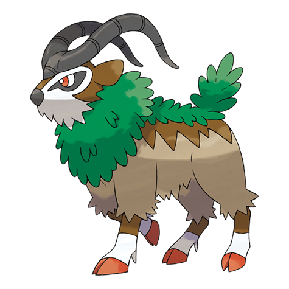

# Gogoat (#0673)

*Mount Pokemon*

**Type:** Erba
**Abilities:** [[Sap Sipper]], [[Grass Pelt]] *(Hidden)*
**Base HP:** 6

> In the wild, they inhabit mountain regions with the leader of the herd decided by a battle of clashing horns. People rely on Gogoat to get them through harsh terrains as it always knows where you want to go.

---

## Statistiche (Attributes & Limits)

| Attribute | Base / Limit |
|---|---|
| **Strength** | 3/6 |
| **Dexterity** | 2/4 |
| **Vitality** | 2/4 |
| **Special** | 2/5 |
| **Insight** | 2/4 |

---

## Mosse (Learnset)

- **Starter:** [[Tackle|Tackle]], [[Growl|Growl]]
- **Beginner:** [[Vine_Whip|Vine Whip]], [[Tail_Whip|Tail Whip]], [[Worry_Seed|Worry Seed]]
- **Amateur:** [[Razor_Leaf|Razor Leaf]], [[Leech_Seed|Leech Seed]], [[Synthesis|Synthesis]], [[Take_Down|Take Down]], [[Bulldoze|Bulldoze]], [[Seed_Bomb|Seed Bomb]], [[Bulk_Up|Bulk Up]]
- **Ace:** [[Double_Edge|Double-Edge]], [[Horn_Leech|Horn Leech]], [[Leaf_Blade|Leaf Blade]], [[Milk_Drink|Milk Drink]], [[Earthquake|Earthquake]], [[Aerial_Ace|Aerial Ace]]
- **Pro:** [[Zen_Headbutt|Zen Headbutt]], [[Bounce|Bounce]], [[Superpower|Superpower]]

---

## Correlati

### Catena Evolutiva
- [[0672_Skiddo|Skiddo]]
- [[0673_Gogoat|Gogoat]]

