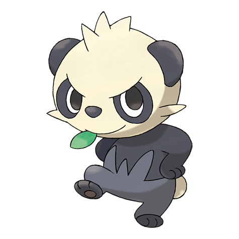

# Pancham (#0674)

*Playful Pokemon*

**Type:** Lotta
**Abilities:** [[Iron Fist]], [[Mold Breaker]], [[Scrappy]] *(Hidden)*
**Base HP:** 3

> It lives in bamboo forests. It is very energetic and playful, but wants to be taken seriously. It has a hard time due to its cute appearance, for this reason it may start hanging out with the wrong crowd.

---

## Statistiche (Attributes & Limits)

| Attribute | Base / Limit |
|---|---|
| **Strength** | 2/5 |
| **Dexterity** | 1/3 |
| **Vitality** | 2/4 |
| **Special** | 2/4 |
| **Insight** | 2/4 |

---

## Mosse (Learnset)

- **Starter:** [[Tackle|Tackle]], [[Leer|Leer]]
- **Beginner:** [[Arm_Thrust|Arm Thrust]], [[Work_Up|Work Up]]
- **Amateur:** [[Karate_Chop|Karate Chop]], [[Comet_Punch|Comet Punch]], [[Slash|Slash]], [[Circle_Throw|Circle Throw]], [[Vital_Throw|Vital Throw]], [[Body_Slam|Body Slam]]
- **Ace:** [[Crunch|Crunch]], [[Entrainment|Entrainment]], [[Parting_Shot|Parting Shot]], [[Sky_Uppercut|Sky Uppercut]]
- **Pro:** [[Ice_Punch|Ice Punch]], [[Thunder_Punch|Thunder Punch]], [[Fire_Punch|Fire Punch]]

---

## Correlati

### Catena Evolutiva
- [[0674_Pancham|Pancham]]
- [[0675_Pangoro|Pangoro]]

