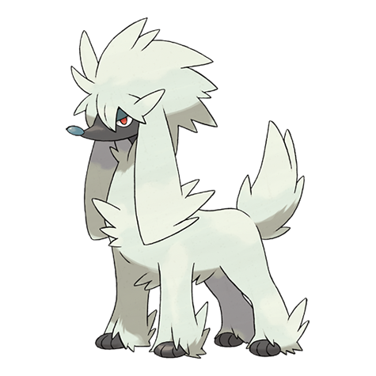

# Furfrou (#0676)

*Poodle Pokemon*

**Type:** Normale
**Abilities:** [[Fur Coat]]
**Base HP:** 4

> Historically, these Pokemon were the designated guardians of the kings. They are popular pets now and people love to trim their fur into exotic hairstyles. But their protective nature has never been lost.

---

## Statistiche (Attributes & Limits)

| Attribute | Base / Limit |
|---|---|
| **Strength** | 2/5 |
| **Dexterity** | 3/6 |
| **Vitality** | 2/4 |
| **Special** | 2/4 |
| **Insight** | 2/5 |

---

## Mosse (Learnset)

- **Starter:** [[Tackle|Tackle]], [[Growl|Growl]]
- **Beginner:** [[Sand_Attack|Sand Attack]], [[Baby_Doll_Eyes|Baby-Doll Eyes]], [[Take_Down|Take Down]]
- **Amateur:** [[Tail_Whip|Tail Whip]], [[Bite|Bite]], [[Odor_Sleuth|Odor Sleuth]], [[Retaliate|Retaliate]], [[Headbutt|Headbutt]], [[Charm|Charm]]
- **Ace:** [[Sucker_Punch|Sucker Punch]], [[Cotton_Guard|Cotton Guard]]
- **Pro:** [[Hyper_Voice|Hyper Voice]], [[Last_Resort|Last Resort]], [[Work_Up|Work Up]]

---

