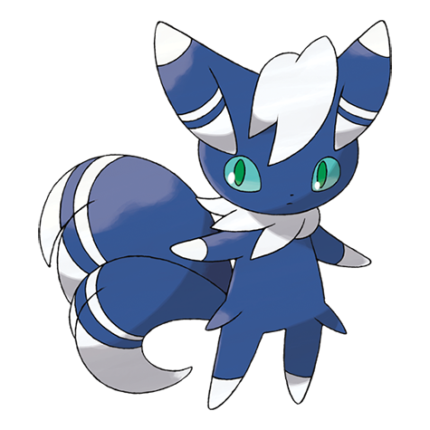

# Meowstic (#0678)

*Constraint Pokemon*

**Type:** Psico
**Abilities:** [[Keen Eye]], [[Infiltrator]], [[Prankster]] *(Hidden)*
**Base HP:** 4

> The eye patterns on the interior of its ears emit psychic energy. It keeps them tightly covered because the power can be overwhelming. Females are white in color and more aggressive than the males.

---

## Statistiche (Attributes & Limits)

| Attribute | Base / Limit |
|---|---|
| **Strength** | 2/4 |
| **Dexterity** | 3/6 |
| **Vitality** | 2/5 |
| **Special** | 2/5 |
| **Insight** | 2/5 |

---

## Mosse (Learnset)

- **Starter:** [[Mean_Look|Mean Look]], [[Magical_Leaf|Magical Leaf]], [[Scratch|Scratch]], [[Leer|Leer]]
- **Beginner:** [[Fake_Out|Fake Out]], [[Disarming_Voice|Disarming Voice]], [[Confusion|Confusion]]
- **Amateur:** [[Helping_Hand|Helping Hand]], [[Stored_Power|Stored Power]], [[Charm|Charm]], [[Charge_Beam|Charge Beam]], [[Covet|Covet]], [[Psybeam|Psybeam]], [[Sucker_Punch|Sucker Punch]], [[Role_Play|Role Play]], [[Light_Screen|Light Screen]], [[Reflect|Reflect]], [[Psyshock|Psyshock]], [[Extrasensory|Extrasensory]]
- **Ace:** [[Imprison|Imprison]], [[Quick_Guard|Quick Guard]], [[Shadow_Ball|Shadow Ball]], [[Psychic|Psychic]], [[Misty_Terrain|Misty Terrain]]
- **Pro:** [[Shock_Wave|Shock Wave]], [[Tickle|Tickle]], [[Yawn|Yawn]]

---

## Correlati

### Catena Evolutiva
- [[0677_Espurr|Espurr]]
- [[0678_Meowstic|Meowstic]]

