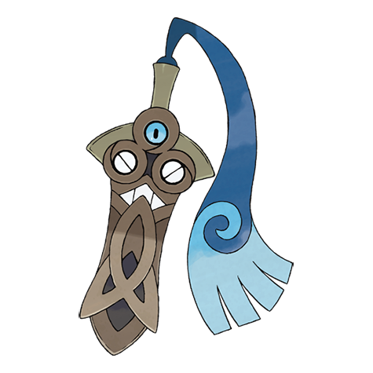

# Honedge (#0679)

*Sword Pokemon*

**Type:** Acciaio / Spettro
**Abilities:** [[No Guard]]
**Base HP:** 3

> During ancient war times this ruthless Pokemon was born from the spirits of warriors who died in battle. It is a cursed sword that seeks revenge and bloodshed. It will drain the life energy of anyone that wields it.

---

## Statistiche (Attributes & Limits)

| Attribute | Base / Limit |
|---|---|
| **Strength** | 2/5 |
| **Dexterity** | 1/3 |
| **Vitality** | 3/6 |
| **Special** | 1/3 |
| **Insight** | 1/3 |

---

## Mosse (Learnset)

- **Starter:** [[Tackle|Tackle]], [[Swords_Dance|Swords Dance]]
- **Beginner:** [[Fury_Cutter|Fury Cutter]], [[Metal_Sound|Metal Sound]]
- **Amateur:** [[Pursuit|Pursuit]], [[Autotomize|Autotomize]], [[Shadow_Sneak|Shadow Sneak]], [[Aerial_Ace|Aerial Ace]], [[Retaliate|Retaliate]], [[Slash|Slash]], [[Night_Slash|Night Slash]]
- **Ace:** [[Iron_Defense|Iron Defense]], [[Power_Trick|Power Trick]], [[Iron_Head|Iron Head]], [[Sacred_Sword|Sacred Sword]]
- **Pro:** [[Destiny_Bond|Destiny Bond]], [[Spite|Spite]], [[Wide_Guard|Wide Guard]]

---

## Correlati

### Catena Evolutiva
- [[0679_Honedge|Honedge]]
- [[0680_Doublade|Doublade]]
- [[0681_Aegislash|Aegislash]]
- Aegislash (Blade Form)

