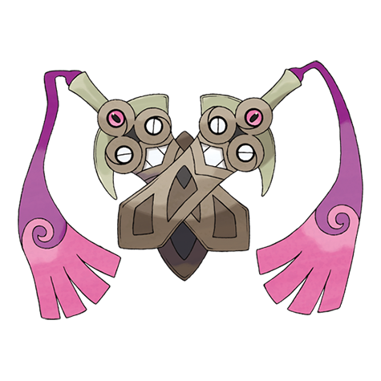

# Doublade (#0680)

*Sword Pokemon*

**Type:** Acciaio / Spettro
**Abilities:** [[No Guard]]
**Base HP:** 4

> Both swords share a telepathic link to coordinate attacks and slash their enemies to shreds. They feed on the rage of their wielder and promise to make him unbeatable at the cost of his flesh and soul.

---

## Statistiche (Attributes & Limits)

| Attribute | Base / Limit |
|---|---|
| **Strength** | 3/6 |
| **Dexterity** | 1/3 |
| **Vitality** | 4/8 |
| **Special** | 2/4 |
| **Insight** | 2/4 |

---

## Mosse (Learnset)

- **Starter:** [[Tackle|Tackle]], [[Swords_Dance|Swords Dance]]
- **Beginner:** [[Fury_Cutter|Fury Cutter]], [[Metal_Sound|Metal Sound]]
- **Amateur:** [[Pursuit|Pursuit]], [[Autotomize|Autotomize]], [[Shadow_Sneak|Shadow Sneak]], [[Aerial_Ace|Aerial Ace]], [[Retaliate|Retaliate]], [[Slash|Slash]], [[Night_Slash|Night Slash]]
- **Ace:** [[Iron_Defense|Iron Defense]], [[Power_Trick|Power Trick]], [[Iron_Head|Iron Head]], [[Sacred_Sword|Sacred Sword]]
- **Pro:** [[Destiny_Bond|Destiny Bond]], [[Spite|Spite]], [[Wide_Guard|Wide Guard]]

---

## Correlati

### Catena Evolutiva
- [[0679_Honedge|Honedge]]
- [[0680_Doublade|Doublade]]
- [[0681_Aegislash|Aegislash]]
- Aegislash (Blade Form)

