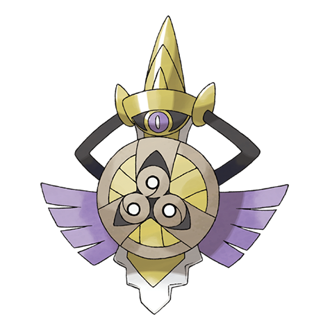

# Aegislash (#0681)

*Royal Sword Pokemon*

**Type:** Acciaio / Spettro
**Abilities:** [[Stance Change]]
**Base HP:** 5

> The legend tells of how this Pokemon lead the first King of Kalos to victory. A crushing grip can be felt on the arm of the wielder. While in this form it can only use Support moves.

---

## Statistiche (Attributes & Limits)

| Attribute | Base / Limit |
|---|---|
| **Strength** | 2/4 |
| **Dexterity** | 1/3 |
| **Vitality** | 4/8 |
| **Special** | 2/4 |
| **Insight** | 4/8 |

---

## Mosse (Learnset)

- **Amateur:** [[Fury_Cutter|Fury Cutter]], [[Pursuit|Pursuit]], [[Autotomize|Autotomize]], [[Shadow_Sneak|Shadow Sneak]], [[Aerial_Ace|Aerial Ace]], [[Slash|Slash]], [[Night_Slash|Night Slash]]
- **Ace:** [[Iron_Defense|Iron Defense]], [[Power_Trick|Power Trick]], [[Iron_Head|Iron Head]], [[Kings_Shield|King's Shield]], [[Head_Smash|Head Smash]], [[Sacred_Sword|Sacred Sword]]
- **Pro:** [[Spite|Spite]], [[Magnet_Rise|Magnet Rise]], [[Destiny_Bond|Destiny Bond]]

---

## Correlati

### Catena Evolutiva
- [[0679_Honedge|Honedge]]
- [[0680_Doublade|Doublade]]
- [[0681_Aegislash|Aegislash]]
- Aegislash (Blade Form)

---

## Aegislash (Forma Lama) (#0681F1)

**Type:** Acciaio / Spettro
**Abilities:** [[Stance Change]]
**Base HP:** 5

| Attribute | Base / Limit |
|---|---|
| **Strength** | 4/8 |
| **Dexterity** | 1/3 |
| **Vitality** | 2/4 |
| **Special** | 4/8 |
| **Insight** | 2/4 |

### Mosse

- **Amateur:** [[Fury_Cutter|Fury Cutter]], [[Pursuit|Pursuit]], [[Autotomize|Autotomize]], [[Shadow_Sneak|Shadow Sneak]], [[Aerial_Ace|Aerial Ace]], [[Slash|Slash]], [[Night_Slash|Night Slash]]
- **Ace:** [[Iron_Defense|Iron Defense]], [[Power_Trick|Power Trick]], [[Iron_Head|Iron Head]], [[Kings_Shield|King's Shield]], [[Head_Smash|Head Smash]], [[Sacred_Sword|Sacred Sword]]
- **Pro:** [[Spite|Spite]], [[Magnet_Rise|Magnet Rise]], [[Destiny_Bond|Destiny Bond]]

