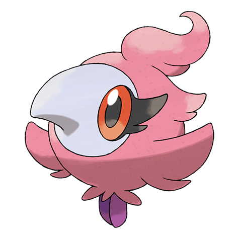

# Spritzee (#0682)

*Perfume Pokemon*

**Type:** Folletto
**Abilities:** [[Healer]], [[Aroma Veil]] *(Hidden)*
**Base HP:** 3

> In the past, rather than using a perfume, royal ladies had a Spritzee that would waft a fragrance they liked. They are popular today for this same reason. They are said to attract the opposite gender to you.

---

## Statistiche (Attributes & Limits)

| Attribute | Base / Limit |
|---|---|
| **Strength** | 2/4 |
| **Dexterity** | 1/3 |
| **Vitality** | 2/4 |
| **Special** | 2/4 |
| **Insight** | 2/4 |

---

## Mosse (Learnset)

- **Starter:** [[Sweet_Scent|Sweet Scent]], [[Fairy_Wind|Fairy Wind]]
- **Beginner:** [[Sweet_Kiss|Sweet Kiss]], [[Odor_Sleuth|Odor Sleuth]]
- **Amateur:** [[Echoed_Voice|Echoed Voice]], [[Calm_Mind|Calm Mind]], [[Draining_Kiss|Draining Kiss]], [[Aromatherapy|Aromatherapy]], [[Attract|Attract]], [[Moonblast|Moonblast]], [[Charm|Charm]]
- **Ace:** [[Flail|Flail]], [[Misty_Terrain|Misty Terrain]], [[Skill_Swap|Skill Swap]], [[Psychic|Psychic]], [[Disarming_Voice|Disarming Voice]]
- **Pro:** [[Captivate|Captivate]], [[Disable|Disable]], [[Covet|Covet]]

---

## Correlati

### Catena Evolutiva
- [[0682_Spritzee|Spritzee]]
- [[0683_Aromatisse|Aromatisse]]

