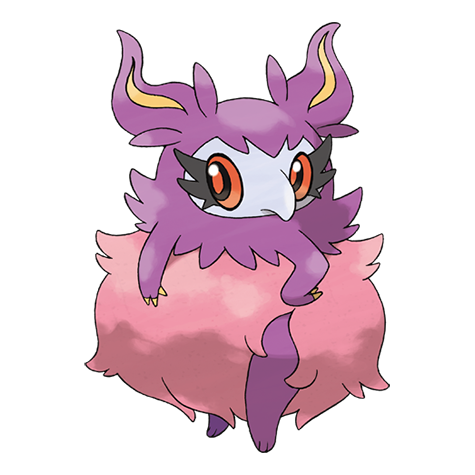

# Aromatisse (#0683)

*Fragance Pokemon*

**Type:** Folletto
**Abilities:** [[Healer]], [[Aroma Veil]] *(Hidden)*
**Base HP:** 5

> Its scent is so overpowering that makes it difficult to simply be in close proximity to it. It emits scents that its foes dislike in order to gain an edge in battle. They can also produce pleasant and healing aromas.

---

## Statistiche (Attributes & Limits)

| Attribute | Base / Limit |
|---|---|
| **Strength** | 2/5 |
| **Dexterity** | 1/3 |
| **Vitality** | 2/5 |
| **Special** | 3/6 |
| **Insight** | 2/5 |

---

## Mosse (Learnset)

- **Starter:** [[Sweet_Scent|Sweet Scent]], [[Fairy_Wind|Fairy Wind]]
- **Beginner:** [[Sweet_Kiss|Sweet Kiss]], [[Odor_Sleuth|Odor Sleuth]]
- **Amateur:** [[Aromatic_Mist|Aromatic Mist]], [[Heal_Pulse|Heal Pulse]], [[Echoed_Voice|Echoed Voice]], [[Calm_Mind|Calm Mind]], [[Draining_Kiss|Draining Kiss]], [[Aromatherapy|Aromatherapy]], [[Attract|Attract]], [[Moonblast|Moonblast]], [[Charm|Charm]]
- **Ace:** [[Flail|Flail]], [[Misty_Terrain|Misty Terrain]], [[Skill_Swap|Skill Swap]], [[Psychic|Psychic]], [[Disarming_Voice|Disarming Voice]], [[Reflect|Reflect]], [[Psych_Up|Psych Up]]
- **Pro:** [[Captivate|Captivate]], [[Disable|Disable]], [[Drain_Punch|Drain Punch]]

---

## Correlati

### Catena Evolutiva
- [[0682_Spritzee|Spritzee]]
- [[0683_Aromatisse|Aromatisse]]

