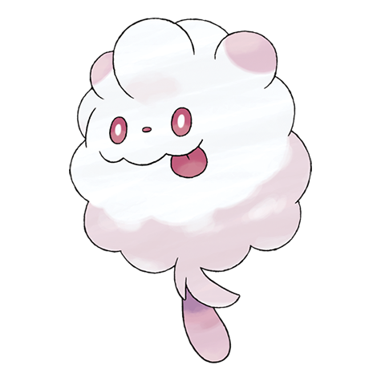

# Swirlix (#0684)

*Cotton Candy Pokemon*

**Type:** Folletto
**Abilities:** [[Sweet Veil]], [[Unburden]] *(Hidden)*
**Base HP:** 3

> Because it eats nothing but sweet fruit, honey and sugars, its fur is as sticky and sweet as cotton candy. To entangle its opponents in battle, it extrudes white and sticky threads but the foes end up eating them.

---

## Statistiche (Attributes & Limits)

| Attribute | Base / Limit |
|---|---|
| **Strength** | 2/4 |
| **Dexterity** | 2/4 |
| **Vitality** | 2/4 |
| **Special** | 2/4 |
| **Insight** | 2/4 |

---

## Mosse (Learnset)

- **Starter:** [[Tackle|Tackle]], [[Sweet_Scent|Sweet Scent]]
- **Beginner:** [[Fairy_Wind|Fairy Wind]], [[Play_Nice|Play Nice]], [[Fake_Tears|Fake Tears]]
- **Amateur:** [[Round|Round]], [[Cotton_Spore|Cotton Spore]], [[Endeavor|Endeavor]], [[Aromatherapy|Aromatherapy]], [[Draining_Kiss|Draining Kiss]], [[Energy_Ball|Energy Ball]], [[Cotton_Guard|Cotton Guard]]
- **Ace:** [[Wish|Wish]], [[Play_Rough|Play Rough]], [[Light_Screen|Light Screen]], [[Safeguard|Safeguard]]
- **Pro:** [[Gastro_Acid|Gastro Acid]], [[Helping_Hand|Helping Hand]], [[Copycat|Copycat]]

---

## Correlati

### Catena Evolutiva
- [[0684_Swirlix|Swirlix]]
- [[0685_Slurpuff|Slurpuff]]

