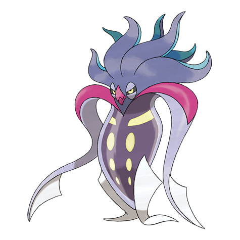

# Malamar (#0687)

*Overturning Pokemon*

**Type:** Buio / Psico
**Abilities:** [[Contrary]], [[Suction Cups]], [[Infiltrator]] *(Hidden)*
**Base HP:** 4

> It lures prey close with hypnotic motions, then wraps its tentacles around it before finishing it off to eat it. This Pokemon are difficult to handle as they use their psychic abilities to do evil.

---

## Statistiche (Attributes & Limits)

| Attribute | Base / Limit |
|---|---|
| **Strength** | 2/5 |
| **Dexterity** | 2/5 |
| **Vitality** | 2/5 |
| **Special** | 2/4 |
| **Insight** | 2/5 |

---

## Mosse (Learnset)

- **Starter:** [[Constrict|Constrict]], [[Tackle|Tackle]], [[Peck|Peck]]
- **Beginner:** [[Foul_Play|Foul Play]], [[Reflect|Reflect]]
- **Amateur:** [[Reversal|Reversal]], [[Swagger|Swagger]], [[Psywave|Psywave]], [[Topsy_Turvy|Topsy-Turvy]], [[Hypnosis|Hypnosis]], [[Psybeam|Psybeam]], [[Switcheroo|Switcheroo]], [[Payback|Payback]], [[Pluck|Pluck]]
- **Ace:** [[Light_Screen|Light Screen]], [[Psycho_Cut|Psycho Cut]], [[Slash|Slash]], [[Night_Slash|Night Slash]], [[Superpower|Superpower]]
- **Pro:** [[Power_Split|Power Split]], [[Knock_Off|Knock Off]], [[Simple_Beam|Simple Beam]]

---

## Correlati

### Catena Evolutiva
- [[0686_Inkay|Inkay]]
- [[0687_Malamar|Malamar]]

