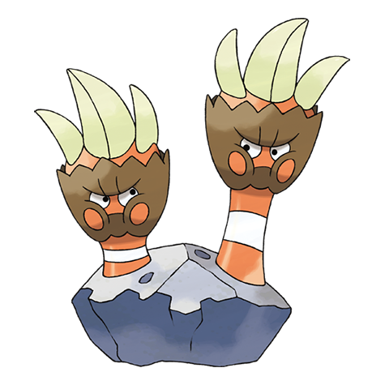

# Binacle (#0688)

*Two-Handed Pokemon*

**Type:** Roccia / Acqua
**Abilities:** [[Sniper]], [[Tough Claws]], [[Pickpocket]] *(Hidden)*
**Base HP:** 3

> In the shallow sea, two Binacle live inside a hollow rock. If they don’t get along, one of them will move to a different rock. They eat the sea weed that washes up on the shore and help each other to survive.

---

## Statistiche (Attributes & Limits)

| Attribute | Base / Limit |
|---|---|
| **Strength** | 2/4 |
| **Dexterity** | 2/4 |
| **Vitality** | 2/4 |
| **Special** | 1/3 |
| **Insight** | 2/4 |

---

## Mosse (Learnset)

- **Starter:** [[Sand_Attack|Sand Attack]], [[Scratch|Scratch]]
- **Beginner:** [[Withdraw|Withdraw]], [[Water_Gun|Water Gun]], [[Fury_Swipes|Fury Swipes]]
- **Amateur:** [[Fury_Cutter|Fury Cutter]], [[Slash|Slash]], [[Mud_Slap|Mud Slap]], [[Clamp|Clamp]], [[Rock_Polish|Rock Polish]], [[Ancient_Power|Ancient Power]], [[Hone_Claws|Hone Claws]]
- **Ace:** [[Shell_Smash|Shell Smash]], [[Night_Slash|Night Slash]], [[Razor_Shell|Razor Shell]], [[Cross_Chop|Cross Chop]]
- **Pro:** [[Helping_Hand|Helping Hand]], [[Stealth_Rock|Stealth Rock]], [[Tickle|Tickle]]

---

## Correlati

### Catena Evolutiva
- [[0688_Binacle|Binacle]]
- [[0689_Barbaracle|Barbaracle]]

