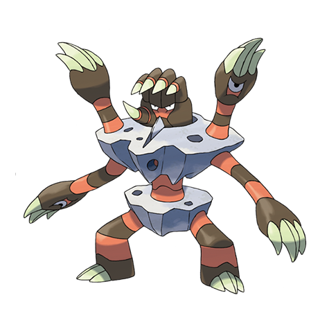

# Barbaracle (#0689)

*Collective Pokemon*

**Type:** Roccia / Acqua
**Abilities:** [[Sniper]], [[Tough Claws]], [[Pickpocket]] *(Hidden)*
**Base HP:** 4

> When they evolve, the two Binacle multiply into seven. They all defend the rock they live in but each one has a mind of their own and will move independently - They tend to follow the head’s orders, though.

---

## Statistiche (Attributes & Limits)

| Attribute | Base / Limit |
|---|---|
| **Strength** | 3/6 |
| **Dexterity** | 2/4 |
| **Vitality** | 3/6 |
| **Special** | 2/4 |
| **Insight** | 2/5 |

---

## Mosse (Learnset)

- **Starter:** [[Sand_Attack|Sand Attack]], [[Scratch|Scratch]]
- **Beginner:** [[Withdraw|Withdraw]], [[Water_Gun|Water Gun]], [[Fury_Swipes|Fury Swipes]]
- **Amateur:** [[Fury_Cutter|Fury Cutter]], [[Slash|Slash]], [[Mud_Slap|Mud Slap]], [[Clamp|Clamp]], [[Rock_Polish|Rock Polish]], [[Ancient_Power|Ancient Power]], [[Hone_Claws|Hone Claws]]
- **Ace:** [[Shell_Smash|Shell Smash]], [[Night_Slash|Night Slash]], [[Razor_Shell|Razor Shell]], [[Cross_Chop|Cross Chop]], [[Stone_Edge|Stone Edge]], [[Skull_Bash|Skull Bash]]
- **Pro:** [[Helping_Hand|Helping Hand]], [[Dual_Chop|Dual Chop]], [[Iron_Defense|Iron Defense]]

---

## Correlati

### Catena Evolutiva
- [[0688_Binacle|Binacle]]
- [[0689_Barbaracle|Barbaracle]]

