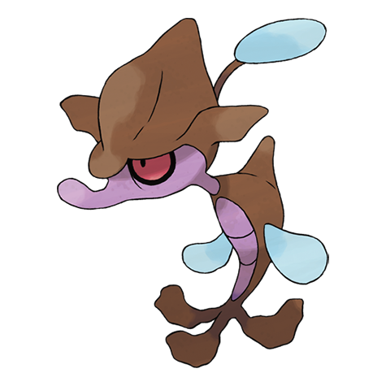

# Skrelp (#0690)

*Mock Kelp Pokemon*

**Type:** Veleno / Acqua
**Abilities:** [[Poison Point]], [[Poison Touch]], [[Adaptability]] *(Hidden)*
**Base HP:** 3

> Camouflaged as rotten kelp they spray liquid poison on a prey that approaches unaware. It needs to store a lot of energy to be able to evolve so it takes them a long time. Touching one will give you a fever.

---

## Statistiche (Attributes & Limits)

| Attribute | Base / Limit |
|---|---|
| **Strength** | 2/4 |
| **Dexterity** | 1/3 |
| **Vitality** | 2/4 |
| **Special** | 2/4 |
| **Insight** | 2/4 |

---

## Mosse (Learnset)

- **Starter:** [[Tackle|Tackle]], [[Smokescreen|Smokescreen]], [[Water_Gun|Water Gun]]
- **Beginner:** [[Feint_Attack|Feint Attack]], [[Tail_Whip|Tail Whip]], [[Bubble|Bubble]]
- **Amateur:** [[Acid|Acid]], [[Camouflage|Camouflage]], [[Poison_Tail|Poison Tail]], [[Water_Pulse|Water Pulse]], [[Double_Team|Double Team]], [[Toxic|Toxic]]
- **Ace:** [[Aqua_Tail|Aqua Tail]], [[Sludge_Bomb|Sludge Bomb]], [[Hydro_Pump|Hydro Pump]], [[Dragon_Pulse|Dragon Pulse]]
- **Pro:** [[Acid_Armor|Acid Armor]], [[Toxic_Spikes|Toxic Spikes]], [[Venom_Drench|Venom Drench]]

---

## Correlati

### Catena Evolutiva
- [[0690_Skrelp|Skrelp]]
- [[0691_Dragalge|Dragalge]]

