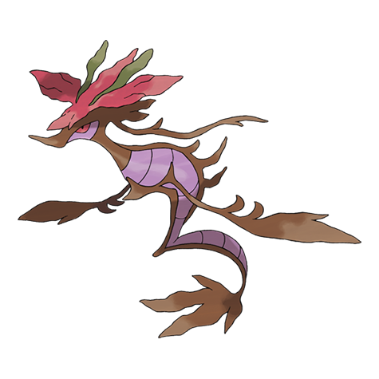

# Dragalge (#0691)

*Mock Kelp Pokemon*

**Type:** Veleno / Drago
**Abilities:** [[Poison Point]], [[Poison Touch]], [[Adaptability]] *(Hidden)*
**Base HP:** 6

> Their poison is strong enough to eat through the hull of a tanker, and they spit it indiscriminately at anything that enters their territory. Touching them can be fatal if you are not treated within a few hours.

---

## Statistiche (Attributes & Limits)

| Attribute | Base / Limit |
|---|---|
| **Strength** | 2/5 |
| **Dexterity** | 2/4 |
| **Vitality** | 2/5 |
| **Special** | 3/6 |
| **Insight** | 3/7 |

---

## Mosse (Learnset)

- **Starter:** [[Tackle|Tackle]], [[Smokescreen|Smokescreen]], [[Water_Gun|Water Gun]]
- **Beginner:** [[Feint_Attack|Feint Attack]], [[Tail_Whip|Tail Whip]], [[Bubble|Bubble]]
- **Amateur:** [[Twister|Twister]], [[Dragon_Tail|Dragon Tail]], [[Acid|Acid]], [[Camouflage|Camouflage]], [[Poison_Tail|Poison Tail]], [[Water_Pulse|Water Pulse]], [[Double_Team|Double Team]], [[Toxic|Toxic]]
- **Ace:** [[Aqua_Tail|Aqua Tail]], [[Sludge_Bomb|Sludge Bomb]], [[Hydro_Pump|Hydro Pump]], [[Dragon_Pulse|Dragon Pulse]]
- **Pro:** [[Acid_Armor|Acid Armor]], [[Gunk_Shot|Gunk Shot]], [[Outrage|Outrage]]

---

## Correlati

### Catena Evolutiva
- [[0690_Skrelp|Skrelp]]
- [[0691_Dragalge|Dragalge]]

