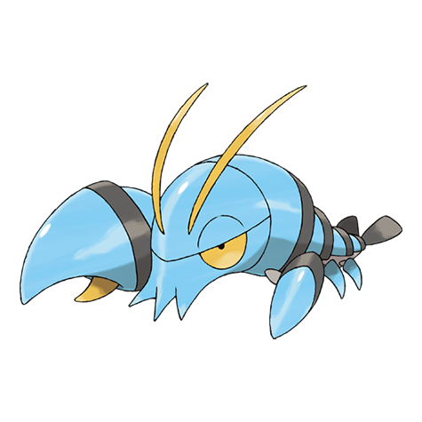

# Clauncher (#0692)

*Water Gun Pokemon*

**Type:** Acqua
**Abilities:** [[Mega Launcher]]
**Base HP:** 3

> They live in beaches and shallow waters. They can knock down a flying prey by shooting water from their massive claws. Their shell is very though but their meat is delicious.

---

## Statistiche (Attributes & Limits)

| Attribute | Base / Limit |
|---|---|
| **Strength** | 2/4 |
| **Dexterity** | 1/3 |
| **Vitality** | 2/4 |
| **Special** | 2/4 |
| **Insight** | 2/4 |

---

## Mosse (Learnset)

- **Starter:** [[Splash|Splash]], [[Water_Gun|Water Gun]]
- **Beginner:** [[Water_Sport|Water Sport]], [[Vice_Grip|Vice Grip]], [[Bubble|Bubble]]
- **Amateur:** [[Flail|Flail]], [[Bubble_Beam|Bubble Beam]], [[Swords_Dance|Swords Dance]], [[Crabhammer|Crabhammer]], [[Smack_Down|Smack Down]]
- **Ace:** [[Water_Pulse|Water Pulse]], [[Aqua_Jet|Aqua Jet]], [[Muddy_Water|Muddy Water]]
- **Pro:** [[Icy_Wind|Icy Wind]], [[Helping_Hand|Helping Hand]], [[Endure|Endure]]

---

## Correlati

### Catena Evolutiva
- [[0692_Clauncher|Clauncher]]
- [[0693_Clawitzer|Clawitzer]]

