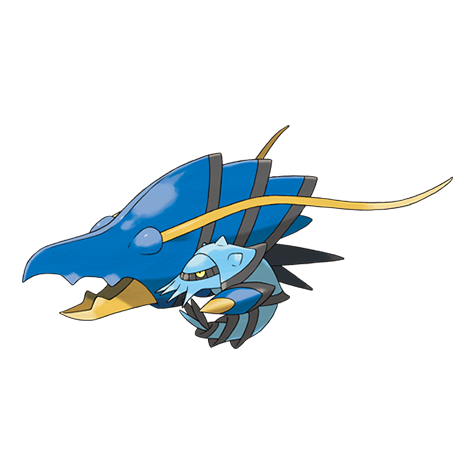

# Clawitzer (#0693)

*Howitzer Pokemon*

**Type:** Acqua
**Abilities:** [[Mega Launcher]]
**Base HP:** 4

> They can be seen swimming backwards using their launcher as A propulsor, but they usually stay at the bottom of the sea. Their meat is tough and bitter so people don’t use them as food anymore.

---

## Statistiche (Attributes & Limits)

| Attribute | Base / Limit |
|---|---|
| **Strength** | 2/5 |
| **Dexterity** | 2/4 |
| **Vitality** | 2/5 |
| **Special** | 3/7 |
| **Insight** | 2/5 |

---

## Mosse (Learnset)

- **Starter:** [[Splash|Splash]], [[Water_Gun|Water Gun]]
- **Beginner:** [[Water_Sport|Water Sport]], [[Vice_Grip|Vice Grip]], [[Bubble|Bubble]]
- **Amateur:** [[Aura_Sphere|Aura Sphere]], [[Bubble_Beam|Bubble Beam]], [[Flail|Flail]], [[Crabhammer|Crabhammer]], [[Swords_Dance|Swords Dance]], [[Smack_Down|Smack Down]], [[Water_Pulse|Water Pulse]]
- **Ace:** [[Heal_Pulse|Heal Pulse]], [[Aqua_Jet|Aqua Jet]], [[Muddy_Water|Muddy Water]], [[Dark_Pulse|Dark Pulse]], [[Dragon_Pulse|Dragon Pulse]]
- **Pro:** [[Icy_Wind|Icy Wind]], [[Helping_Hand|Helping Hand]], [[Endure|Endure]]

---

## Correlati

### Catena Evolutiva
- [[0692_Clauncher|Clauncher]]
- [[0693_Clawitzer|Clawitzer]]

