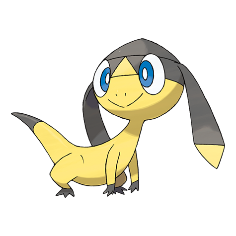

# Helioptile (#0694)

*Generator Pokemon*

**Type:** Elettro / Normale
**Abilities:** [[Dry Skin]], [[Sand Veil]], [[Solar Power]] *(Hidden)*
**Base HP:** 3

> They make their home in deserts. Using the sun, they can generate their energy by basking their frills since food is scarce where they live. They run pretty fast as to not burn themselves with the hot sand.

---

## Statistiche (Attributes & Limits)

| Attribute | Base / Limit |
|---|---|
| **Strength** | 1/3 |
| **Dexterity** | 2/5 |
| **Vitality** | 1/3 |
| **Special** | 2/4 |
| **Insight** | 1/3 |

---

## Mosse (Learnset)

- **Starter:** [[Pound|Pound]], [[Tail_Whip|Tail Whip]]
- **Beginner:** [[Thunder_Shock|Thunder Shock]], [[Charge|Charge]]
- **Amateur:** [[Mud_Slap|Mud Slap]], [[Quick_Attack|Quick Attack]], [[Razor_Wind|Razor Wind]], [[Parabolic_Charge|Parabolic Charge]], [[Thunder_Wave|Thunder Wave]], [[Bulldoze|Bulldoze]]
- **Ace:** [[Volt_Switch|Volt Switch]], [[Electrify|Electrify]], [[Thunderbolt|Thunderbolt]]
- **Pro:** [[Agility|Agility]], [[Electroweb|Electroweb]], [[Magnet_Rise|Magnet Rise]]

---

## Correlati

### Catena Evolutiva
- [[0694_Helioptile|Helioptile]]
- [[0695_Heliolisk|Heliolisk]]

