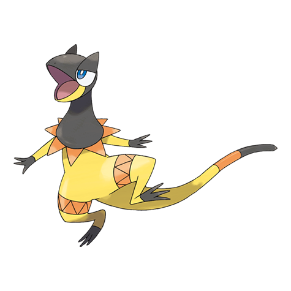

# Heliolisk (#0695)

*Generator Pokemon*

**Type:** Elettro / Normale
**Abilities:** [[Dry Skin]], [[Sand Veil]], [[Solar Power]] *(Hidden)*
**Base HP:** 4

> They flare their frills and generate energy. A single Heliolisk is able to generate enough power to light a skyscraper. Due to this, electricity companies are investing on breeding and research for this species.

---

## Statistiche (Attributes & Limits)

| Attribute | Base / Limit |
|---|---|
| **Strength** | 2/4 |
| **Dexterity** | 3/6 |
| **Vitality** | 2/4 |
| **Special** | 3/6 |
| **Insight** | 2/5 |

---

## Mosse (Learnset)

- **Beginner:** [[Charge|Charge]]
- **Amateur:** [[Eerie_Impulse|Eerie Impulse]], [[Quick_Attack|Quick Attack]], [[Razor_Wind|Razor Wind]], [[Parabolic_Charge|Parabolic Charge]]
- **Ace:** [[Electrify|Electrify]], [[Thunder|Thunder]]
- **Pro:** [[Agility|Agility]], [[Hyper_Voice|Hyper Voice]], [[Fire_Punch|Fire Punch]]

---

## Correlati

### Catena Evolutiva
- [[0694_Helioptile|Helioptile]]
- [[0695_Heliolisk|Heliolisk]]

