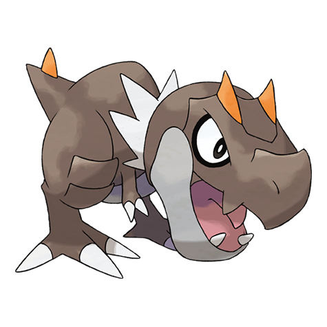

# Tyrunt (#0696)

*Royal Heir Pokemon*

**Type:** Roccia / Drago
**Abilities:** [[Strong Jaw]], [[Sturdy]] *(Hidden)*
**Base HP:** 3

> This Pokemon was restored from a fossil. If something happens that it doesn’t like, it throws a tantrum and runs wild. Many of the researchers that brought it back were attacked by its powerful jaws.

---

## Statistiche (Attributes & Limits)

| Attribute | Base / Limit |
|---|---|
| **Strength** | 2/5 |
| **Dexterity** | 2/4 |
| **Vitality** | 2/5 |
| **Special** | 2/4 |
| **Insight** | 2/4 |

---

## Mosse (Learnset)

- **Starter:** [[Tackle|Tackle]], [[Tail_Whip|Tail Whip]], [[Roar|Roar]]
- **Beginner:** [[Stomp|Stomp]], [[Bide|Bide]]
- **Amateur:** [[Stealth_Rock|Stealth Rock]], [[Bite|Bite]], [[Charm|Charm]], [[Ancient_Power|Ancient Power]], [[Dragon_Tail|Dragon Tail]], [[Crunch|Crunch]], [[Dragon_Claw|Dragon Claw]]
- **Ace:** [[Thrash|Thrash]], [[Earthquake|Earthquake]], [[Horn_Drill|Horn Drill]]
- **Pro:** [[Fire_Fang|Fire Fang]], [[Thunder_Fang|Thunder Fang]], [[Ice_Fang|Ice Fang]]

---

## Correlati

### Catena Evolutiva
- [[0696_Tyrunt|Tyrunt]]
- [[0697_Tyrantrum|Tyrantrum]]

