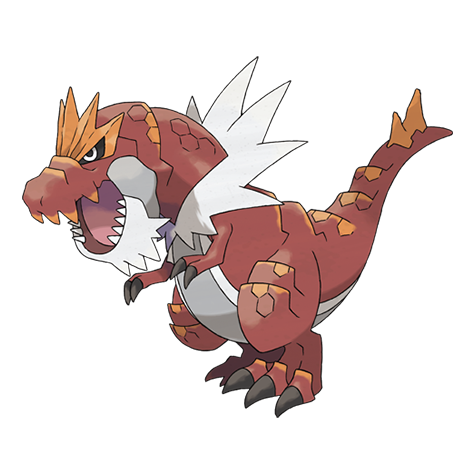

# Tyrantrum (#0697)

*Despot Pokemon*

**Type:** Roccia / Drago
**Abilities:** [[Strong Jaw]], [[Rock Head]] *(Hidden)*
**Base HP:** 4

> Nothing could stop this Pokemon 100 million years ago, it was a prehistoric king. Thanks to its giant jaws, which could shred thick metal plates as if they were paper, this Pokemon takes orders from no one.

---

## Statistiche (Attributes & Limits)

| Attribute | Base / Limit |
|---|---|
| **Strength** | 3/7 |
| **Dexterity** | 2/5 |
| **Vitality** | 3/7 |
| **Special** | 2/4 |
| **Insight** | 2/4 |

---

## Mosse (Learnset)

- **Starter:** [[Tackle|Tackle]], [[Tail_Whip|Tail Whip]], [[Roar|Roar]]
- **Beginner:** [[Stomp|Stomp]], [[Bide|Bide]]
- **Amateur:** [[Stealth_Rock|Stealth Rock]], [[Bite|Bite]], [[Charm|Charm]], [[Ancient_Power|Ancient Power]], [[Dragon_Tail|Dragon Tail]], [[Crunch|Crunch]], [[Dragon_Claw|Dragon Claw]], [[Thrash|Thrash]]
- **Ace:** [[Earthquake|Earthquake]], [[Horn_Drill|Horn Drill]], [[Head_Smash|Head Smash]], [[Rock_Slide|Rock Slide]], [[Giga_Impact|Giga Impact]]
- **Pro:** [[Dragon_Dance|Dragon Dance]], [[Poison_Fang|Poison Fang]], [[Outrage|Outrage]]

---

## Correlati

### Catena Evolutiva
- [[0696_Tyrunt|Tyrunt]]
- [[0697_Tyrantrum|Tyrantrum]]

