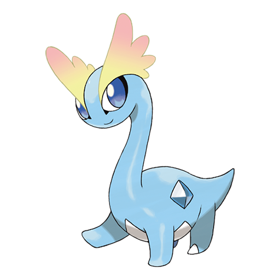

# Amaura (#0698)

*Tundra Pokemon*

**Type:** Roccia / Ghiaccio
**Abilities:** [[Refrigerate]], [[Snow Warning]] *(Hidden)*
**Base HP:** 3

> This ancient Pokemon was restored from part of its body that had been frozen for over 100 million years. This calm Pokemon lived in the cold lands where violent predators like Tyrantrum couldn’t reach it.

---

## Statistiche (Attributes & Limits)

| Attribute | Base / Limit |
|---|---|
| **Strength** | 2/4 |
| **Dexterity** | 2/4 |
| **Vitality** | 2/4 |
| **Special** | 2/4 |
| **Insight** | 2/4 |

---

## Mosse (Learnset)

- **Starter:** [[Growl|Growl]], [[Powder_Snow|Powder Snow]]
- **Beginner:** [[Thunder_Wave|Thunder Wave]], [[Rock_Throw|Rock Throw]], [[Icy_Wind|Icy Wind]]
- **Amateur:** [[Take_Down|Take Down]], [[Mist|Mist]], [[Aurora_Beam|Aurora Beam]], [[Ancient_Power|Ancient Power]], [[Round|Round]], [[Avalanche|Avalanche]], [[Hail|Hail]], [[Nature_Power|Nature Power]]
- **Ace:** [[Encore|Encore]], [[Light_Screen|Light Screen]], [[Ice_Beam|Ice Beam]], [[Hyper_Beam|Hyper Beam]], [[Blizzard|Blizzard]]
- **Pro:** [[Earth_Power|Earth Power]], [[Stealth_Rock|Stealth Rock]], [[Water_Pulse|Water Pulse]]

---

## Correlati

### Catena Evolutiva
- [[0698_Amaura|Amaura]]
- [[0699_Aurorus|Aurorus]]

