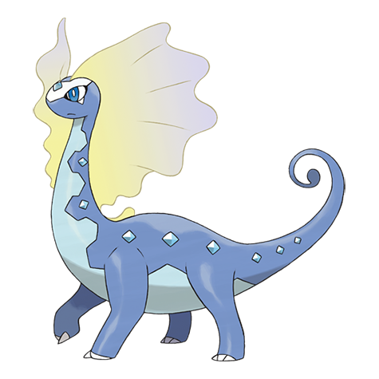

# Aurorus (#0699)

*Tundra Pokemon*

**Type:** Roccia / Ghiaccio
**Abilities:** [[Refrigerate]], [[Snow Warning]] *(Hidden)*
**Base HP:** 6

> It produced a freezing cold mist from the crystals on its sides and relied on size to deter predators. It also created tall walls of ice to block them. The one restored from the fossil is calm and has adapted well.

---

## Statistiche (Attributes & Limits)

| Attribute | Base / Limit |
|---|---|
| **Strength** | 2/5 |
| **Dexterity** | 2/4 |
| **Vitality** | 2/5 |
| **Special** | 3/6 |
| **Insight** | 2/5 |

---

## Mosse (Learnset)

- **Starter:** [[Growl|Growl]], [[Powder_Snow|Powder Snow]]
- **Beginner:** [[Thunder_Wave|Thunder Wave]], [[Rock_Throw|Rock Throw]], [[Icy_Wind|Icy Wind]]
- **Amateur:** [[Take_Down|Take Down]], [[Mist|Mist]], [[Aurora_Beam|Aurora Beam]], [[Ancient_Power|Ancient Power]], [[Round|Round]], [[Avalanche|Avalanche]], [[Hail|Hail]], [[Nature_Power|Nature Power]]
- **Ace:** [[Encore|Encore]], [[Light_Screen|Light Screen]], [[Ice_Beam|Ice Beam]], [[Hyper_Beam|Hyper Beam]], [[Blizzard|Blizzard]], [[Freeze_Dry|Freeze Dry]]
- **Pro:** [[Iron_Defense|Iron Defense]], [[Discharge|Discharge]], [[Outrage|Outrage]]

---

## Correlati

### Catena Evolutiva
- [[0698_Amaura|Amaura]]
- [[0699_Aurorus|Aurorus]]

