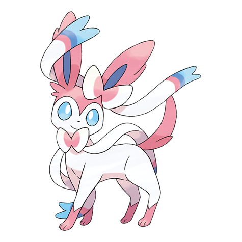

# Sylveon (#0700)

*Intertwining Pokemon*

**Type:** Folletto
**Abilities:** [[Cute Charm]], [[Pixilate]] *(Hidden)*
**Base HP:** 4

> This rare and adorable Pokemon emanates a soothing aura to calm disturbances. It is said that only the Trainers who form an unbreakable bond with their Eevee can ever see this Pokemon.

---

## Statistiche (Attributes & Limits)

| Attribute | Base / Limit |
|---|---|
| **Strength** | 2/4 |
| **Dexterity** | 2/4 |
| **Vitality** | 2/4 |
| **Special** | 3/6 |
| **Insight** | 3/7 |

---

## Mosse (Learnset)

- **Starter:** [[Tackle|Tackle]], [[Tail_Whip|Tail Whip]]
- **Beginner:** [[Sand_Attack|Sand Attack]], [[Helping_Hand|Helping Hand]], [[Fairy_Wind|Fairy Wind]]
- **Amateur:** [[Disarming_Voice|Disarming Voice]], [[Quick_Attack|Quick Attack]], [[Swift|Swift]], [[Draining_Kiss|Draining Kiss]], [[Skill_Swap|Skill Swap]], [[Misty_Terrain|Misty Terrain]], [[Light_Screen|Light Screen]]
- **Ace:** [[Moonblast|Moonblast]], [[Last_Resort|Last Resort]], [[Psych_Up|Psych Up]]
- **Pro:** [[Captivate|Captivate]], [[Wish|Wish]], [[Hyper_Voice|Hyper Voice]]

---

