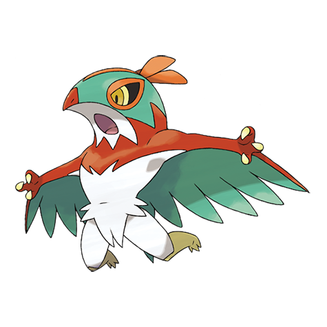

# Hawlucha (#0701)

*Wrestling Pokemon*

**Type:** Lotta / Volante
**Abilities:** [[Limber]], [[Unburden]], [[Mold Breaker]] *(Hidden)*
**Base HP:** 4

> Although small in size, its proficient fighting skills enable it to keep up with big bruisers like Machamp and Hariyama. Using its wings to attack from above allows it to gain an edge in battle.

---

## Statistiche (Attributes & Limits)

| Attribute | Base / Limit |
|---|---|
| **Strength** | 2/5 |
| **Dexterity** | 3/6 |
| **Vitality** | 2/5 |
| **Special** | 2/5 |
| **Insight** | 2/4 |

---

## Mosse (Learnset)

- **Starter:** [[Detect|Detect]], [[Tackle|Tackle]], [[Hone_Claws|Hone Claws]]
- **Beginner:** [[Karate_Chop|Karate Chop]], [[Wing_Attack|Wing Attack]]
- **Amateur:** [[Roost|Roost]], [[Aerial_Ace|Aerial Ace]], [[Encore|Encore]], [[Fling|Fling]], [[Flying_Press|Flying Press]], [[Bounce|Bounce]], [[Endeavor|Endeavor]], [[Feather_Dance|Feather Dance]]
- **Ace:** [[High_Jump_Kick|High Jump Kick]], [[Sky_Attack|Sky Attack]], [[Sky_Drop|Sky Drop]], [[Swords_Dance|Swords Dance]]
- **Pro:** [[Thunder_Punch|Thunder Punch]], [[Dual_Chop|Dual Chop]], [[Tailwind|Tailwind]]

---

