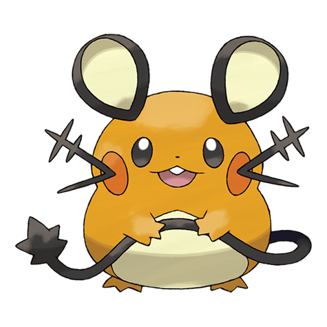

# Dedenne (#0702)

*Antenna Pokemon*

**Type:** Elettro / Folletto
**Abilities:** [[Cheek Pouch]], [[Pickup]], [[Plus]] *(Hidden)*
**Base HP:** 4

> The tail is used to absorb electricity from power outlets. They communicate with each other by feeling the static on their whiskers. Its cute and cuddly appearance make it a favorite pet.

---

## Statistiche (Attributes & Limits)

| Attribute | Base / Limit |
|---|---|
| **Strength** | 2/4 |
| **Dexterity** | 3/6 |
| **Vitality** | 2/4 |
| **Special** | 2/5 |
| **Insight** | 2/4 |

---

## Mosse (Learnset)

- **Starter:** [[Tackle|Tackle]], [[Tail_Whip|Tail Whip]]
- **Beginner:** [[Thunder_Shock|Thunder Shock]], [[Charge|Charge]]
- **Amateur:** [[Charm|Charm]], [[Parabolic_Charge|Parabolic Charge]], [[Nuzzle|Nuzzle]], [[Thunder_Wave|Thunder Wave]], [[Volt_Switch|Volt Switch]], [[Rest|Rest]], [[Snore|Snore]], [[Charge_Beam|Charge Beam]]
- **Ace:** [[Entrainment|Entrainment]], [[Play_Rough|Play Rough]], [[Thunder|Thunder]], [[Discharge|Discharge]]
- **Pro:** [[Super_Fang|Super Fang]], [[Iron_Tail|Iron Tail]], [[Eerie_Impulse|Eerie Impulse]]

---

