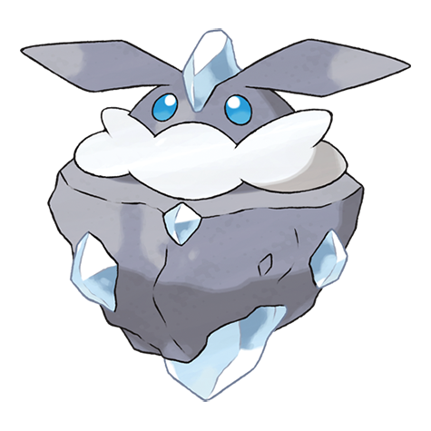

# Carbink (#0703)

*Jewel Pokemon*

**Type:** Roccia / Folletto
**Abilities:** [[Clear Body]], [[Sturdy]] *(Hidden)*
**Base HP:** 4

> It’s occasionally found at drilling zones and excavations in caves. Born from temperature and pressure deep underground, it shoots beams from the stone in its head. They can live for hundreds of years.

---

## Statistiche (Attributes & Limits)

| Attribute | Base / Limit |
|---|---|
| **Strength** | 2/4 |
| **Dexterity** | 2/4 |
| **Vitality** | 3/7 |
| **Special** | 2/4 |
| **Insight** | 3/7 |

---

## Mosse (Learnset)

- **Starter:** [[Tackle|Tackle]], [[Harden|Harden]]
- **Beginner:** [[Rock_Throw|Rock Throw]], [[Sharpen|Sharpen]]
- **Amateur:** [[Smack_Down|Smack Down]], [[Reflect|Reflect]], [[Stealth_Rock|Stealth Rock]], [[Guard_Split|Guard Split]], [[Ancient_Power|Ancient Power]], [[Flail|Flail]], [[Skill_Swap|Skill Swap]], [[Power_Gem|Power Gem]]
- **Ace:** [[Stone_Edge|Stone Edge]], [[Moonblast|Moonblast]], [[Light_Screen|Light Screen]], [[Moonblast|Moonblast]]
- **Pro:** [[Light_Screen|Light Screen]], [[Safeguard|Safeguard]], [[Gravity|Gravity]]

---

