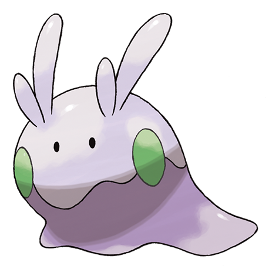

# Goomy (#0704)

*Soft Tissue Pokemon*

**Type:** Drago
**Abilities:** [[Sap Sipper]], [[Hydration]], [[Gooey]] *(Hidden)*
**Base HP:** 3

> The weakest but best tempered Dragon Pokemon known. It lives in damp and shady places, so its body doesn’t dry out. It’s covered in a slimy membrane that makes things slide off of it.

---

## Statistiche (Attributes & Limits)

| Attribute | Base / Limit |
|---|---|
| **Strength** | 2/4 |
| **Dexterity** | 1/3 |
| **Vitality** | 1/3 |
| **Special** | 2/4 |
| **Insight** | 2/5 |

---

## Mosse (Learnset)

- **Starter:** [[Tackle|Tackle]], [[Bubble|Bubble]]
- **Beginner:** [[Absorb|Absorb]], [[Protect|Protect]]
- **Amateur:** [[Bide|Bide]], [[Dragon_Breath|Dragon Breath]], [[Rain_Dance|Rain Dance]]
- **Ace:** [[Flail|Flail]], [[Body_Slam|Body Slam]], [[Muddy_Water|Muddy Water]], [[Dragon_Pulse|Dragon Pulse]]
- **Pro:** [[Water_Pulse|Water Pulse]], [[Acid_Armor|Acid Armor]], [[Counter|Counter]]

---

## Correlati

### Catena Evolutiva
- [[0704_Goomy|Goomy]]
- [[0705_Sliggoo|Sliggoo]]
- [[0706_Goodra|Goodra]]

