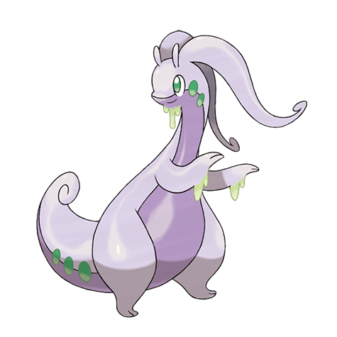

# Goodra (#0706)

*Dragon Pokemon*

**Type:** Drago
**Abilities:** [[Sap Sipper]], [[Hydration]], [[Gooey]] *(Hidden)*
**Base HP:** 5

> Definitely the friendliest of all Dragons. This Pokemon will hug its beloved Trainer, leaving them covered in sticky slime. In areas with heavy rainfall during the year, one or two may make an appearance.

---

## Statistiche (Attributes & Limits)

| Attribute | Base / Limit |
|---|---|
| **Strength** | 3/6 |
| **Dexterity** | 2/5 |
| **Vitality** | 2/5 |
| **Special** | 3/6 |
| **Insight** | 3/7 |

---

## Mosse (Learnset)

- **Starter:** [[Bubble|Bubble]], [[Tackle|Tackle]]
- **Beginner:** [[Protect|Protect]], [[Absorb|Absorb]]
- **Amateur:** [[Feint|Feint]], [[Bide|Bide]], [[Dragon_Breath|Dragon Breath]], [[Rain_Dance|Rain Dance]], [[Flail|Flail]], [[Body_Slam|Body Slam]], [[Muddy_Water|Muddy Water]], [[Dragon_Pulse|Dragon Pulse]], [[Aqua_Tail|Aqua Tail]]
- **Ace:** [[Power_Whip|Power Whip]], [[Outrage|Outrage]]
- **Pro:** [[Shock_Wave|Shock Wave]], [[Superpower|Superpower]], [[Draco_Meteor|Draco Meteor]]

---

## Correlati

### Catena Evolutiva
- [[0704_Goomy|Goomy]]
- [[0705_Sliggoo|Sliggoo]]
- [[0706_Goodra|Goodra]]

