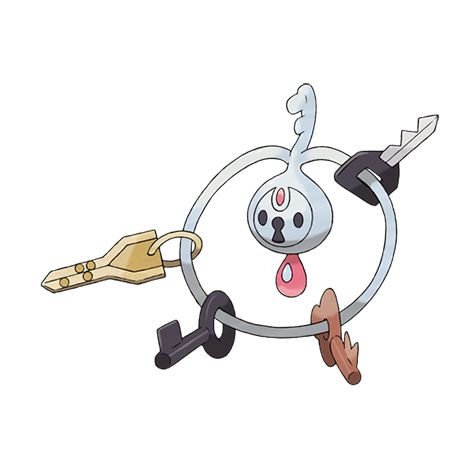

# Klefki (#0707)

*Key Ring Pokemon*

**Type:** Acciaio / Folletto
**Abilities:** [[Prankster]], [[Magician]] *(Hidden)*
**Base HP:** 4

> It adapted well to live with humans. Klefki jingle the objects they collect when they are distressed. People trust them with their keys to vaults and safes because they are very careful with their collection.

---

## Statistiche (Attributes & Limits)

| Attribute | Base / Limit |
|---|---|
| **Strength** | 2/5 |
| **Dexterity** | 2/5 |
| **Vitality** | 2/5 |
| **Special** | 2/5 |
| **Insight** | 2/5 |

---

## Mosse (Learnset)

- **Starter:** [[Fairy_Lock|Fairy Lock]], [[Tackle|Tackle]]
- **Beginner:** [[Fairy_Wind|Fairy Wind]], [[Astonish|Astonish]]
- **Amateur:** [[Metal_Sound|Metal Sound]], [[Spikes|Spikes]], [[Draining_Kiss|Draining Kiss]], [[Crafty_Shield|Crafty Shield]], [[Foul_Play|Foul Play]], [[Torment|Torment]], [[Mirror_Shot|Mirror Shot]], [[Imprison|Imprison]]
- **Ace:** [[Recycle|Recycle]], [[Play_Rough|Play Rough]], [[Magic_Room|Magic Room]], [[Heal_Block|Heal Block]]
- **Pro:** [[Iron_Defense|Iron Defense]], [[Switcheroo|Switcheroo]], [[Magnet_Rise|Magnet Rise]]

---

