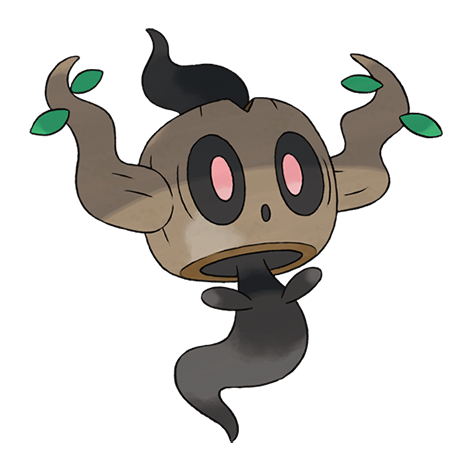

# Phantump (#0708)

*Stump Pokemon*

**Type:** Spettro / Erba
**Abilities:** [[Natural Cure]], [[Frisk]], [[Harvest]] *(Hidden)*
**Base HP:** 3

> According to the old tales, these Pokemon are stumps possessed by the spirits of children who were lost in the forest. They prefer to live in abandoned woods and lure people to the darkness to play with them.

---

## Statistiche (Attributes & Limits)

| Attribute | Base / Limit |
|---|---|
| **Strength** | 2/5 |
| **Dexterity** | 1/3 |
| **Vitality** | 2/4 |
| **Special** | 2/4 |
| **Insight** | 2/4 |

---

## Mosse (Learnset)

- **Starter:** [[Tackle|Tackle]], [[Confuse_Ray|Confuse Ray]]
- **Beginner:** [[Astonish|Astonish]], [[Growth|Growth]]
- **Amateur:** [[Ingrain|Ingrain]], [[Feint_Attack|Feint Attack]], [[Leech_Seed|Leech Seed]], [[Curse|Curse]], [[Will_O_Wisp|Will-O-Wisp]], [[Forests_Curse|Forest's Curse]]
- **Ace:** [[Destiny_Bond|Destiny Bond]], [[Phantom_Force|Phantom Force]], [[Wood_Hammer|Wood Hammer]], [[Horn_Leech|Horn Leech]]
- **Pro:** [[Seed_Bomb|Seed Bomb]], [[Venom_Drench|Venom Drench]], [[Worry_Seed|Worry Seed]]

---

## Correlati

### Catena Evolutiva
- [[0708_Phantump|Phantump]]
- [[0709_Trevenant|Trevenant]]

