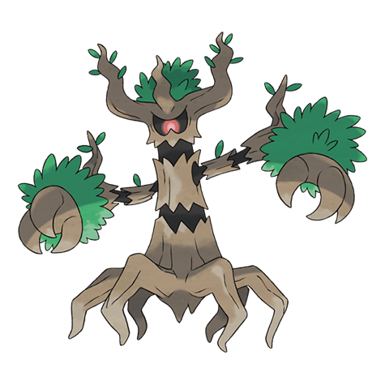

# Trevenant (#0709)

*Elder Tree Pokemon*

**Type:** Spettro / Erba
**Abilities:** [[Natural Cure]], [[Frisk]], [[Harvest]] *(Hidden)*
**Base HP:** 5

> Using its roots as a nervous system it controls the trees in the forest. It’s kind to the Pokemon that reside inside its body but it is ruthless to anyone that harms its forest, turning them into haunted trees forever.

---

## Statistiche (Attributes & Limits)

| Attribute | Base / Limit |
|---|---|
| **Strength** | 3/6 |
| **Dexterity** | 2/4 |
| **Vitality** | 2/5 |
| **Special** | 2/4 |
| **Insight** | 2/5 |

---

## Mosse (Learnset)

- **Starter:** [[Confuse_Ray|Confuse Ray]], [[Tackle|Tackle]]
- **Beginner:** [[Growth|Growth]], [[Astonish|Astonish]]
- **Amateur:** [[Horn_Leech|Horn Leech]], [[Ingrain|Ingrain]], [[Feint_Attack|Feint Attack]], [[Leech_Seed|Leech Seed]], [[Curse|Curse]], [[Will_O_Wisp|Will-O-Wisp]], [[Forests_Curse|Forest's Curse]]
- **Ace:** [[Destiny_Bond|Destiny Bond]], [[Phantom_Force|Phantom Force]], [[Wood_Hammer|Wood Hammer]], [[Shadow_Claw|Shadow Claw]]
- **Pro:** [[Grudge|Grudge]], [[Drain_Punch|Drain Punch]], [[Imprison|Imprison]]

---

## Correlati

### Catena Evolutiva
- [[0708_Phantump|Phantump]]
- [[0709_Trevenant|Trevenant]]

