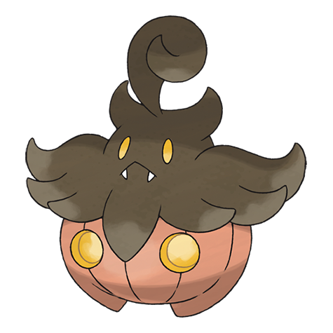

# Pumpkaboo (#0710)

*Pumpkin Pokemon*

**Type:** Spettro / Erba
**Abilities:** [[Pickup]], [[Frisk]], [[Insomnia]] *(Hidden)*
**Base HP:** 3

> You can see them dwelling on farms during the autumn season. The pumpkin body is inhabited by a spirit trapped in this world. As the sun sets, it becomes restless and active. Don’t ever follow their light at night.

---

## Statistiche (Attributes & Limits)

| Attribute | Base / Limit |
|---|---|
| **Strength** | 2/4 |
| **Dexterity** | 2/4 |
| **Vitality** | 2/5 |
| **Special** | 2/4 |
| **Insight** | 2/4 |

---

## Mosse (Learnset)

- **Starter:** [[Trick|Trick]], [[Astonish|Astonish]], [[Confuse_Ray|Confuse Ray]]
- **Beginner:** [[Scary_Face|Scary Face]], [[Trick_Or_Treat|Trick-Or-Treat]], [[Worry_Seed|Worry Seed]]
- **Amateur:** [[Razor_Leaf|Razor Leaf]], [[Leech_Seed|Leech Seed]], [[Bullet_Seed|Bullet Seed]], [[Shadow_Sneak|Shadow Sneak]]
- **Ace:** [[Shadow_Ball|Shadow Ball]], [[Pain_Split|Pain Split]], [[Seed_Bomb|Seed Bomb]]
- **Pro:** [[Dark_Pulse|Dark Pulse]], [[Synthesis|Synthesis]], [[Foul_Play|Foul Play]]

---

## Correlati

### Catena Evolutiva
- [[0710_Pumpkaboo|Pumpkaboo]]
- [[0711_Gourgeist|Gourgeist]]

