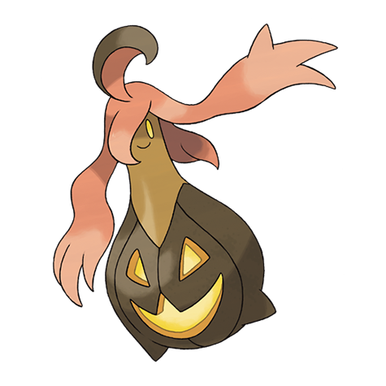

# Gourgeist (#0711)

*Pumpkin Pokemon*

**Type:** Spettro / Erba
**Abilities:** [[Pickup]], [[Frisk]], [[Insomnia]] *(Hidden)*
**Base HP:** 4

> They wander in the town streets every new moon. It wraps its prey on its arms and sings joyfully as it observes the suffering of the victim. Hearing it sing will give you horrible nightmares.

---

## Statistiche (Attributes & Limits)

| Attribute | Base / Limit |
|---|---|
| **Strength** | 2/5 |
| **Dexterity** | 2/5 |
| **Vitality** | 3/7 |
| **Special** | 2/4 |
| **Insight** | 2/5 |

---

## Mosse (Learnset)

- **Starter:** [[Trick|Trick]], [[Astonish|Astonish]], [[Confuse_Ray|Confuse Ray]]
- **Beginner:** [[Scary_Face|Scary Face]], [[Trick_Or_Treat|Trick-Or-Treat]], [[Worry_Seed|Worry Seed]]
- **Amateur:** [[Razor_Leaf|Razor Leaf]], [[Leech_Seed|Leech Seed]], [[Bullet_Seed|Bullet Seed]], [[Shadow_Sneak|Shadow Sneak]]
- **Ace:** [[Phantom_Force|Phantom Force]], [[Explosion|Explosion]], [[Shadow_Ball|Shadow Ball]], [[Pain_Split|Pain Split]], [[Seed_Bomb|Seed Bomb]]
- **Pro:** [[Dark_Pulse|Dark Pulse]], [[Synthesis|Synthesis]], [[Foul_Play|Foul Play]]

---

## Correlati

### Catena Evolutiva
- [[0710_Pumpkaboo|Pumpkaboo]]
- [[0711_Gourgeist|Gourgeist]]

