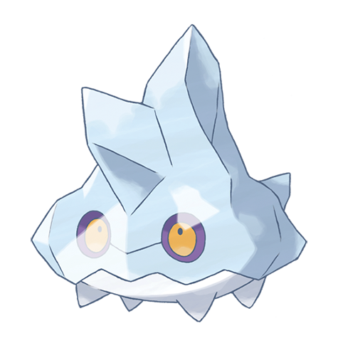

# Bergmite (#0712)

*Ice Chunk Pokemon*

**Type:** Ghiaccio
**Abilities:** [[Own Tempo]], [[Ice Body]], [[Sturdy]] *(Hidden)*
**Base HP:** 3

> They live in small herds close to the mountains. It blocks attacks with the ice that shields its body and uses cold air to repair any cracks with new ice. They are wary of humans as they rarely get to see one.

---

## Statistiche (Attributes & Limits)

| Attribute | Base / Limit |
|---|---|
| **Strength** | 2/4 |
| **Dexterity** | 1/3 |
| **Vitality** | 2/5 |
| **Special** | 1/3 |
| **Insight** | 1/3 |

---

## Mosse (Learnset)

- **Starter:** [[Tackle|Tackle]], [[Powder_Snow|Powder Snow]], [[Harden|Harden]]
- **Beginner:** [[Bite|Bite]], [[Icy_Wind|Icy Wind]], [[Take_Down|Take Down]]
- **Amateur:** [[Sharpen|Sharpen]], [[Curse|Curse]], [[Ice_Fang|Ice Fang]], [[Ice_Ball|Ice Ball]], [[Rapid_Spin|Rapid Spin]], [[Avalanche|Avalanche]]
- **Ace:** [[Blizzard|Blizzard]], [[Recover|Recover]], [[Double_Edge|Double-Edge]]
- **Pro:** [[Water_Pulse|Water Pulse]], [[Mirror_Coat|Mirror Coat]], [[Endure|Endure]]

---

## Correlati

### Catena Evolutiva
- [[0712_Bergmite|Bergmite]]
- [[0713_Avalugg|Avalugg]]

