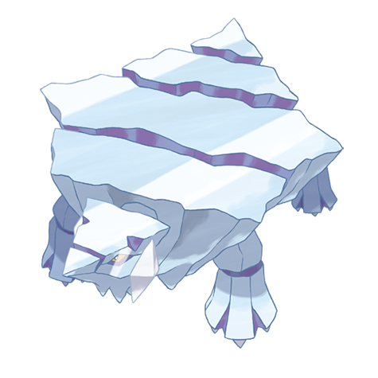

# Avalugg (#0713)

*Iceberg Pokemon*

**Type:** Ghiaccio
**Abilities:** [[Own Tempo]], [[Ice Body]], [[Sturdy]] *(Hidden)*
**Base HP:** 4

> They carry their Bergmite offspring on their backs. Its Ice body is hard as steel and its cumbersome frame crushes anything that stands in its way. They are capable of swimming but they move very slowly.

---

## Statistiche (Attributes & Limits)

| Attribute | Base / Limit |
|---|---|
| **Strength** | 3/6 |
| **Dexterity** | 1/3 |
| **Vitality** | 4/9 |
| **Special** | 1/3 |
| **Insight** | 1/3 |

---

## Mosse (Learnset)

- **Starter:** [[Tackle|Tackle]], [[Powder_Snow|Powder Snow]], [[Harden|Harden]]
- **Beginner:** [[Bite|Bite]], [[Icy_Wind|Icy Wind]], [[Take_Down|Take Down]]
- **Amateur:** [[Iron_Defense|Iron Defense]], [[Crunch|Crunch]], [[Body_Slam|Body Slam]], [[Sharpen|Sharpen]], [[Curse|Curse]], [[Ice_Fang|Ice Fang]], [[Ice_Ball|Ice Ball]], [[Rapid_Spin|Rapid Spin]], [[Avalanche|Avalanche]]
- **Ace:** [[Blizzard|Blizzard]], [[Recover|Recover]], [[Double_Edge|Double-Edge]], [[Skull_Bash|Skull Bash]]
- **Pro:** [[Block|Block]], [[Superpower|Superpower]], [[Iron_Head|Iron Head]]

---

## Correlati

### Catena Evolutiva
- [[0712_Bergmite|Bergmite]]
- [[0713_Avalugg|Avalugg]]

