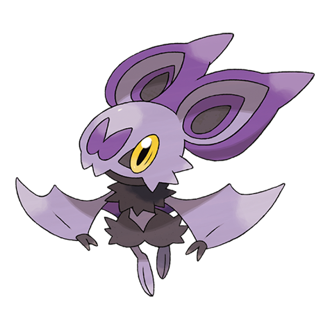

# Noibat (#0714)

*Sound Wave Pokemon*

**Type:** Volante / Drago
**Abilities:** [[Frisk]], [[Infiltrator]], [[Telepathy]] *(Hidden)*
**Base HP:** 3

> They live in dark caves and use echolocation to move around. Their enormous ears can emit ultrasonic waves that cause dizziness. Groups of them can even take on prey several times their size.

---

## Statistiche (Attributes & Limits)

| Attribute | Base / Limit |
|---|---|
| **Strength** | 1/3 |
| **Dexterity** | 2/4 |
| **Vitality** | 1/3 |
| **Special** | 2/4 |
| **Insight** | 1/3 |

---

## Mosse (Learnset)

- **Starter:** [[Screech|Screech]], [[Tackle|Tackle]], [[Supersonic|Supersonic]]
- **Beginner:** [[Absorb|Absorb]], [[Gust|Gust]]
- **Amateur:** [[Bite|Bite]], [[Wing_Attack|Wing Attack]], [[Agility|Agility]], [[Air_Cutter|Air Cutter]], [[Roost|Roost]], [[Razor_Wind|Razor Wind]], [[Tailwind|Tailwind]]
- **Ace:** [[Whirlwind|Whirlwind]], [[Air_Slash|Air Slash]], [[Hurricane|Hurricane]]
- **Pro:** [[Super_Fang|Super Fang]], [[Dark_Pulse|Dark Pulse]], [[Outrage|Outrage]]

---

## Correlati

### Catena Evolutiva
- [[0714_Noibat|Noibat]]
- [[0715_Noivern|Noivern]]

