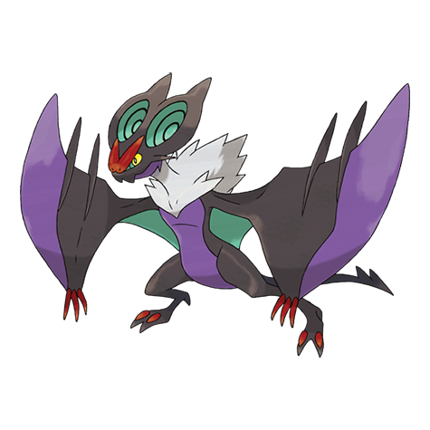

# Noivern (#0715)

*Sound Wave Pokemon*

**Type:** Volante / Drago
**Abilities:** [[Frisk]], [[Infiltrator]], [[Telepathy]] *(Hidden)*
**Base HP:** 4

> They fly during the new moon and attack careless prey. Nothing can beat them in a battle in the dark. To keep them calm you should feed them fruit or else they’ll release shocking ultrasonic waves.

---

## Statistiche (Attributes & Limits)

| Attribute | Base / Limit |
|---|---|
| **Strength** | 2/5 |
| **Dexterity** | 3/7 |
| **Vitality** | 2/5 |
| **Special** | 3/6 |
| **Insight** | 2/5 |

---

## Mosse (Learnset)

- **Starter:** [[Screech|Screech]], [[Tackle|Tackle]], [[Supersonic|Supersonic]]
- **Beginner:** [[Absorb|Absorb]], [[Gust|Gust]]
- **Amateur:** [[Dragon_Pulse|Dragon Pulse]], [[Moonlight|Moonlight]], [[Bite|Bite]], [[Wing_Attack|Wing Attack]], [[Agility|Agility]], [[Air_Cutter|Air Cutter]], [[Roost|Roost]], [[Razor_Wind|Razor Wind]], [[Tailwind|Tailwind]]
- **Ace:** [[Whirlwind|Whirlwind]], [[Super_Fang|Super Fang]], [[Air_Slash|Air Slash]], [[Hurricane|Hurricane]], [[Boomburst|Boomburst]]
- **Pro:** [[Draco_Meteor|Draco Meteor]], [[Sky_Attack|Sky Attack]], [[Heat_Wave|Heat Wave]]

---

## Correlati

### Catena Evolutiva
- [[0714_Noibat|Noibat]]
- [[0715_Noivern|Noivern]]

