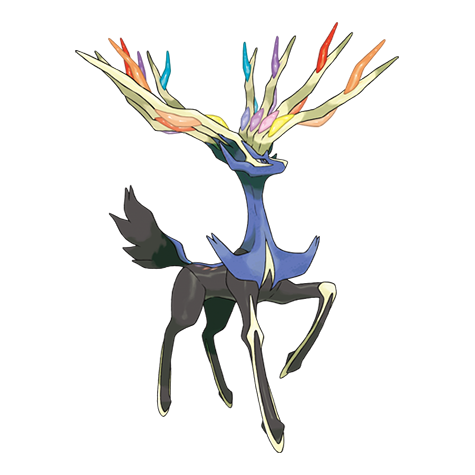

# Xerneas (#0716)

*No Data*

**Type:** Folletto
**Abilities:** [[Fairy Aura]]
**Base HP:** 6

> A Kalos legend tells about the eternal struggle between life and death. In the story an ancient King tried to obtain eternal life and the power to make its loved ones live again.

---

## Statistiche (Attributes & Limits)

| Attribute | Base / Limit |
|---|---|
| **Strength** | 7/7 |
| **Dexterity** | 6/6 |
| **Vitality** | 6/6 |
| **Special** | 7/7 |
| **Insight** | 6/6 |

---

## Mosse (Learnset)

- **Master:** [[Heal_Pulse|Heal Pulse]], [[Aromatherapy|Aromatherapy]], [[Ingrain|Ingrain]], [[Take_Down|Take Down]], [[Light_Screen|Light Screen]], [[Aurora_Beam|Aurora Beam]], [[Gravity|Gravity]], [[Geomancy|Geomancy]], [[Moonblast|Moonblast]], [[Megahorn|Megahorn]], [[Night_Slash|Night Slash]], [[Horn_Leech|Horn Leech]], [[Psych_Up|Psych Up]], [[Misty_Terrain|Misty Terrain]], [[Nature_Power|Nature Power]], [[Close_Combat|Close Combat]], [[Giga_Impact|Giga Impact]], [[Outrage|Outrage]], [[Psyshock|Psyshock]], [[Thunder|Thunder]], [[Reflect|Reflect]], [[Endeavor|Endeavor]]

---

