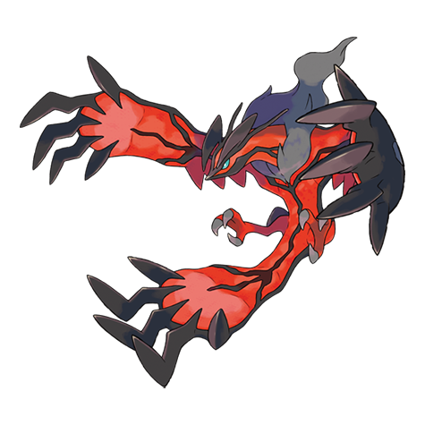

# Yveltal (#0717)

*No Data*

**Type:** Buio / Volante
**Abilities:** [[Dark Aura]]
**Base HP:** 8

> A Kalos legend tells about the eternal struggle between life and death. The main tale is about a King full of grief and hate who built a doomsday machine to kill everyone in the world.

---

## Statistiche (Attributes & Limits)

| Attribute | Base / Limit |
|---|---|
| **Strength** | 7/7 |
| **Dexterity** | 6/6 |
| **Vitality** | 6/6 |
| **Special** | 7/7 |
| **Insight** | 6/6 |

---

## Mosse (Learnset)

- **Master:** [[Hurricane|Hurricane]], [[Razor_Wind|Razor Wind]], [[Taunt|Taunt]], [[Roost|Roost]], [[Double_Team|Double Team]], [[Air_Slash|Air Slash]], [[Snarl|Snarl]], [[Oblivion_Wing|Oblivion Wing]], [[Disable|Disable]], [[Dark_Pulse|Dark Pulse]], [[Foul_Play|Foul Play]], [[Phantom_Force|Phantom Force]], [[Psychic|Psychic]], [[Dragon_Rush|Dragon Rush]], [[Focus_Blast|Focus Blast]], [[Sucker_Punch|Sucker Punch]], [[Hyper_Beam|Hyper Beam]], [[Sky_Attack|Sky Attack]], [[Tailwind|Tailwind]], [[Heat_Wave|Heat Wave]], [[Rain_Dance|Rain Dance]], [[Defog|Defog]]

---

