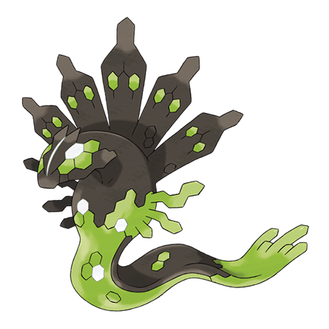

# Zygarde (#0718)

*Order Pokémon*

**Type:** Drago / Terra
**Abilities:** [[Aura Break]], [[Power Construct]]
**Base HP:** 5

> Underground tunnels have been found all over the Kalos Region. There are rumors of a creature who lives in them that attacks people damaging the ecosystem.

---

## Statistiche (Attributes & Limits)

| Attribute | Base / Limit |
|---|---|
| **Strength** | 6/6 |
| **Dexterity** | 6/6 |
| **Vitality** | 7/7 |
| **Special** | 5/5 |
| **Insight** | 6/6 |

---

## Mosse (Learnset)

- **Master:** [[Glare|Glare]], [[Bulldoze|Bulldoze]], [[Dragon_Breath|Dragon Breath]], [[Bite|Bite]], [[Safeguard|Safeguard]], [[Dig|Dig]], [[Bind|Bind]], [[Lands_Wrath|Land's Wrath]], [[Sandstorm|Sandstorm]], [[Haze|Haze]], [[Crunch|Crunch]], [[Earthquake|Earthquake]], [[Camouflage|Camouflage]], [[Dragon_Pulse|Dragon Pulse]], [[Coil|Coil]], [[Outrage|Outrage]], [[Extreme_Speed|Extreme Speed]], [[Dragon_Dance|Dragon Dance]], [[Thousand_Waves|Thousand Waves]], [[Thousand_Arrows|Thousand Arrows]], [[Core_Enforcer|Core Enforcer]], [[Stomping_Tantrum|Stomping Tantrum]]

---

## Correlati

---

## Zygarde (Forma 10%) (#0718F1)

**Type:** Drago / Terra
**Abilities:** [[Aura Break]], [[Power Construct]]
**Base HP:** 4

| Attribute | Base / Limit |
|---|---|
| **Strength** | 6/6 |
| **Dexterity** | 6/6 |
| **Vitality** | 5/5 |
| **Special** | 4/4 |
| **Insight** | 5/5 |

### Mosse

- **Master:** [[Glare|Glare]], [[Bulldoze|Bulldoze]], [[Dragon_Breath|Dragon Breath]], [[Bite|Bite]], [[Safeguard|Safeguard]], [[Dig|Dig]], [[Bind|Bind]], [[Lands_Wrath|Land's Wrath]], [[Sandstorm|Sandstorm]], [[Haze|Haze]], [[Crunch|Crunch]], [[Earthquake|Earthquake]], [[Camouflage|Camouflage]], [[Dragon_Pulse|Dragon Pulse]], [[Coil|Coil]], [[Outrage|Outrage]], [[Extreme_Speed|Extreme Speed]], [[Dragon_Dance|Dragon Dance]], [[Thousand_Waves|Thousand Waves]], [[Thousand_Arrows|Thousand Arrows]]

---

## Zygarde (Forma 100%) (#0718F3)

**Type:** Drago / Terra
**Abilities:** [[Aura Break]]
**Base HP:** 11

| Attribute | Base / Limit |
|---|---|
| **Strength** | 6/6 |
| **Dexterity** | 5/5 |
| **Vitality** | 7/7 |
| **Special** | 5/5 |
| **Insight** | 6/6 |

### Mosse

- **Master:** [[Glare|Glare]], [[Bulldoze|Bulldoze]], [[Dragon_Breath|Dragon Breath]], [[Bite|Bite]], [[Safeguard|Safeguard]], [[Dig|Dig]], [[Bind|Bind]], [[Lands_Wrath|Land's Wrath]], [[Sandstorm|Sandstorm]], [[Haze|Haze]], [[Crunch|Crunch]], [[Earthquake|Earthquake]], [[Camouflage|Camouflage]], [[Dragon_Pulse|Dragon Pulse]], [[Coil|Coil]], [[Outrage|Outrage]], [[Extreme_Speed|Extreme Speed]], [[Dragon_Dance|Dragon Dance]], [[Thousand_Waves|Thousand Waves]], [[Thousand_Arrows|Thousand Arrows]], [[Core_Enforcer|Core Enforcer]], [[Stomping_Tantrum|Stomping Tantrum]], [[Draco_Meteor|Draco Meteor]], [[Hidden_Power|Hidden Power]]
