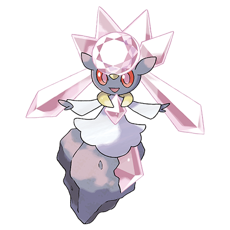
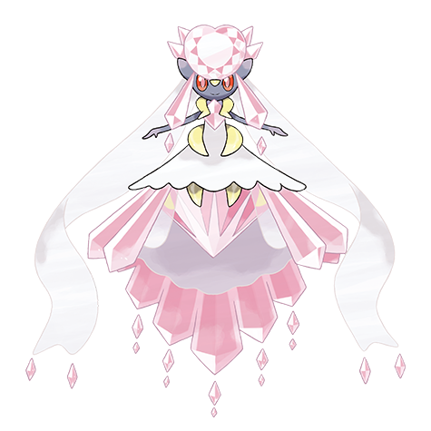

# Diancie (#0719)

*Registered as #703 Carbink*

**Type:** Roccia / Folletto
**Abilities:** [[Clear Body]]
**Base HP:** 4

> The popular saying goes like this: “If you put a Carbon under pressure you will get a Diamond” But it surely was not referring to a Pokemon... or was it?

---

## Statistiche (Attributes & Limits)

| Attribute | Base / Limit |
|---|---|
| **Strength** | 6/6 |
| **Dexterity** | 4/4 |
| **Vitality** | 8/8 |
| **Special** | 6/6 |
| **Insight** | 8/8 |

---

## Mosse (Learnset)

- **Master:** [[Tackle|Tackle]], [[Harden|Harden]], [[Rock_Throw|Rock Throw]], [[Sharpen|Sharpen]], [[Smack_Down|Smack Down]], [[Reflect|Reflect]], [[Stealth_Rock|Stealth Rock]], [[Guard_Split|Guard Split]], [[Ancient_Power|Ancient Power]], [[Flail|Flail]], [[Skill_Swap|Skill Swap]], [[Power_Gem|Power Gem]], [[Trick_Room|Trick Room]], [[Stone_Edge|Stone Edge]], [[Moonblast|Moonblast]], [[Diamond_Storm|Diamond Storm]], [[Light_Screen|Light Screen]], [[Safeguard|Safeguard]], [[Magnet_Rise|Magnet Rise]], [[Iron_Defense|Iron Defense]], [[Dazzling_Gleam|Dazzling Gleam]]

---

## Correlati

### Catena Evolutiva
- [[0719_Diancie|Diancie]]
- Diancie (Mega Form)

---

## Mega Diancie (#0719M1)

**Type:** Roccia / Folletto
**Abilities:** [[Magic Bounce]]
**Base HP:** 5

| Attribute | Base / Limit |
|---|---|
| **Strength** | 8/8 |
| **Dexterity** | 6/6 |
| **Vitality** | 6/6 |
| **Special** | 8/8 |
| **Insight** | 6/6 |

### Mosse

- **Master:** [[Tackle|Tackle]], [[Harden|Harden]], [[Rock_Throw|Rock Throw]], [[Sharpen|Sharpen]], [[Smack_Down|Smack Down]], [[Reflect|Reflect]], [[Stealth_Rock|Stealth Rock]], [[Guard_Split|Guard Split]], [[Ancient_Power|Ancient Power]], [[Flail|Flail]], [[Skill_Swap|Skill Swap]], [[Power_Gem|Power Gem]], [[Trick_Room|Trick Room]], [[Stone_Edge|Stone Edge]], [[Moonblast|Moonblast]], [[Diamond_Storm|Diamond Storm]], [[Light_Screen|Light Screen]], [[Safeguard|Safeguard]], [[Magnet_Rise|Magnet Rise]], [[Iron_Defense|Iron Defense]], [[Dazzling_Gleam|Dazzling Gleam]]

