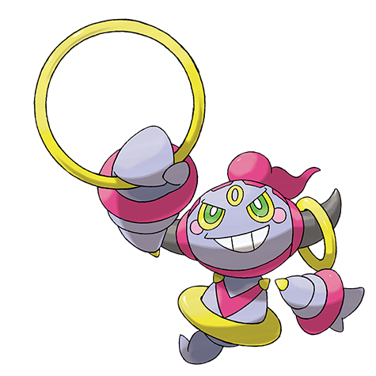

# Hoopa (#0720)

*No Data*

**Type:** Psico / Spettro
**Abilities:** [[Magician]]
**Base HP:** 4

> There is a story of an old demon whose power had to be contained by a spell. The spell was a partial success as the demon could still roam free, but its power and evil was greatly diminished.

---

## Statistiche (Attributes & Limits)

| Attribute | Base / Limit |
|---|---|
| **Strength** | 6/6 |
| **Dexterity** | 5/5 |
| **Vitality** | 4/4 |
| **Special** | 8/8 |
| **Insight** | 7/7 |

---

## Mosse (Learnset)

- **Master:** [[Trick|Trick]], [[Destiny_Bond|Destiny Bond]], [[Ally_Switch|Ally Switch]], [[Confusion|Confusion]], [[Astonish|Astonish]], [[Magic_Coat|Magic Coat]], [[Light_Screen|Light Screen]], [[Psybeam|Psybeam]], [[Skill_Swap|Skill Swap]], [[Power_Split|Power Split]], [[Guard_Split|Guard Split]], [[Phantom_Force|Phantom Force]], [[Zen_Headbutt|Zen Headbutt]], [[Wonder_Room|Wonder Room]], [[Trick_Room|Trick Room]], [[Shadow_Ball|Shadow Ball]], [[Nasty_Plot|Nasty Plot]], [[Psychic|Psychic]], [[Hyperspace_Hole|Hyperspace Hole]], [[Telekinesis|Telekinesis]], [[Magic_Room|Magic Room]], [[Confide|Confide]]

---

## Correlati

### Catena Evolutiva
- [[0720_Hoopa|Hoopa]]
- Hoopa (Unbound Form)

---

## Hoopa (Forma Senza Catene) (#0720M1)

**Type:** Psico / Buio
**Abilities:** [[Magician]]
**Base HP:** 7

| Attribute | Base / Limit |
|---|---|
| **Strength** | 8/8 |
| **Dexterity** | 5/5 |
| **Vitality** | 4/4 |
| **Special** | 9/9 |
| **Insight** | 7/7 |

### Mosse

- **Master:** [[Trick|Trick]], [[Destiny_Bond|Destiny Bond]], [[Ally_Switch|Ally Switch]], [[Confusion|Confusion]], [[Astonish|Astonish]], [[Magic_Coat|Magic Coat]], [[Light_Screen|Light Screen]], [[Psybeam|Psybeam]], [[Skill_Swap|Skill Swap]], [[Power_Split|Power Split]], [[Guard_Split|Guard Split]], [[Knock_Off|Knock Off]], [[Zen_Headbutt|Zen Headbutt]], [[Wonder_Room|Wonder Room]], [[Trick_Room|Trick Room]], [[Dark_Pulse|Dark Pulse]], [[Nasty_Plot|Nasty Plot]], [[Psychic|Psychic]], [[Hyperspace_Hole|Hyperspace Hole]], [[Telekinesis|Telekinesis]], [[Magic_Room|Magic Room]], [[Hyper_Beam|Hyper Beam]], [[Snatch|Snatch]], [[Throat_Chop|Throat Chop]]

