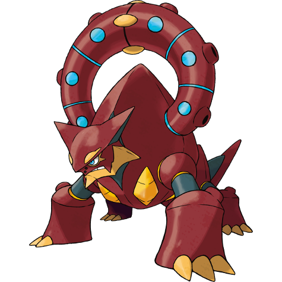

# Volcanion (#0721)

*No Data*

**Type:** Fuoco / Acqua
**Abilities:** [[Water Absorb]]
**Base HP:** 4

> In the early days of world exploring, there are records of an entire mountain blowing up in a cloud of steam. The explorers claimed that a creature in the fog was responsible.

---

## Statistiche (Attributes & Limits)

| Attribute | Base / Limit |
|---|---|
| **Strength** | 6/6 |
| **Dexterity** | 5/5 |
| **Vitality** | 7/7 |
| **Special** | 7/7 |
| **Insight** | 5/5 |

---

## Mosse (Learnset)

- **Master:** [[Flare_Blitz|Flare Blitz]], [[Take_Down|Take Down]], [[Mist|Mist]], [[Haze|Haze]], [[Flame_Charge|Flame Charge]], [[Water_Pulse|Water Pulse]], [[Stomp|Stomp]], [[Scald|Scald]], [[Weather_Ball|Weather Ball]], [[Body_Slam|Body Slam]], [[Hydro_Pump|Hydro Pump]], [[Overheat|Overheat]], [[Explosion|Explosion]], [[Steam_Eruption|Steam Eruption]], [[Solar_Beam|Solar Beam]], [[Earth_Power|Earth Power]], [[Superpower|Superpower]]

---

