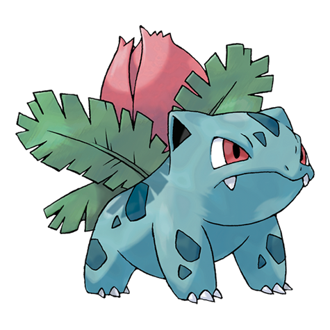

---
title: "Ivysaur (#0002)"
category: Pokedex
tags: [ivysaur, kanto, grass, poison]
image: "assets/images/pokemon/002.png"
---

# Ivysaur (#0002)

*Seed Pokemon*

**Type:** Grass / Poison
**Abilities:** [[Overgrow]], [[Chlorophyll]] *(Hidden)*
**Base HP:** 4

> There is a bud on this Pokemon's back. To support its weight, Ivysaur's legs and trunk grow thick and strong. It becomes kind of a loner after evolving and may stray away from its group to take sunbaths.

---

## Statistiche (Attributes & Limits)

| Attribute | Base / Limit |
|---|---|
| **Strength** | 2/4 |
| **Dexterity** | 2/4 |
| **Vitality** | 2/4 |
| **Special** | 2/5 |
| **Insight** | 2/5 |

---

## Mosse (Learnset)

- **Starter:** [[Tackle]], [[Growl]]
- **Beginner:** [[Leech_Seed]], [[Vine_Whip]]
- **Amateur:** [[Poison_Powder]], [[Sleep_Powder]], [[Take_Down]], [[Razor_Leaf]], [[Sweet_Scent]], [[Growth]]
- **Ace:** [[Double-Edge]], [[Worry_Seed]], [[Synthesis]], [[Solar_Beam]]
- **Pro:** [[Grassy_Terrain]], [[Amnesia]], [[Grass_Pledge]]

---

## Correlati

### Catena Evolutiva
- [[0001_Bulbasaur|Bulbasaur]]
- [[0003_Venusaur|Venusaur]]
