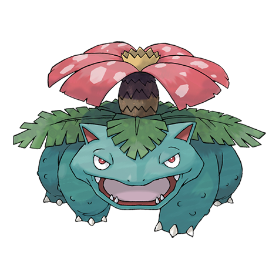

# Venusaur (Mega Form) (#0003M1)

*Seed Pokemon*

**Type:** Erba / Veleno
**Abilities:** [[Thick Fat]]
**Base HP:** 6

> With the power of the Mega Stone, this Pokemon grows taller and thicker. It’s bark and skin are now impervious to the elements.
Its demeanor becomes even more serious and determined.

---

## Statistiche (Attributes & Limits)

| Attribute | Base / Limit |
|---|---|
| **Strength** | 3/6 |
| **Dexterity** | 2/5 |
| **Vitality** | 3/7 |
| **Special** | 3/6 |
| **Insight** | 3/6 |

---

## Mosse (Learnset)

- **Starter:** [[Tackle|Tackle]], [[Growl|Growl]]
- **Beginner:** [[Leech_Seed|Leech Seed]], [[Vine_Whip|Vine Whip]]
- **Amateur:** [[Poison_Powder|Poison Powder]], [[Sleep_Powder|Sleep Powder]], [[Take_Down|Take Down]], [[Razor_Leaf|Razor Leaf]], [[Sweet_Scent|Sweet Scent]], [[Growth|Growth]], [[Double_Edge|Double-Edge]], [[Petal_Dance|Petal Dance]], [[Worry_Seed|Worry Seed]]
- **Ace:** [[Synthesis|Synthesis]], [[Petal_Blizzard|Petal Blizzard]], [[Solar_Beam|Solar Beam]]
- **Pro:** [[Outrage|Outrage]], [[Curse|Curse]], [[Frenzy_Plant|Frenzy Plant]]

---
