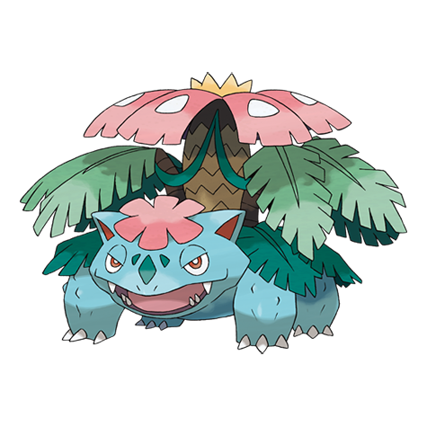
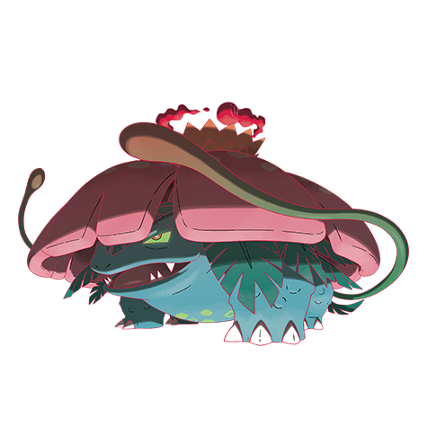

# Venusaur (#0003)

*Seed Pokemon*

**Type:** Grass / Poison
**Abilities:** [[Overgrow]], [[Chlorophyll]] *(Hidden)*
**Base HP:** 5

> Venusaur's flower is said to take on vivid colors if it gets plenty of sun light. The flower’s aroma soothes the emotions of others.
If you find one in the wild, it must be the protector of the area.

---

## Statistiche (Attributes & Limits)

| Attribute | Base / Limit |
|---|---|
| **Strength** | 2/5 |
| **Dexterity** | 2/5 |
| **Vitality** | 2/5 |
| **Special** | 3/6 |
| **Insight** | 3/6 |

---

## Mosse (Learnset)

- **Starter:** [[Tackle]], [[Growl]]
- **Beginner:** [[Leech_Seed]], [[Vine_Whip]]
- **Amateur:** [[Poison_Powder]], [[Sleep_Powder]], [[Take_Down]], [[Razor_Leaf]], [[Sweet_Scent]], [[Growth]], [[Double-Edge]], [[Petal_Dance]], [[Worry_Seed]]
- **Ace:** [[Synthesis]], [[Petal_Blizzard]], [[Solar_Beam]]
- **Pro:** [[Outrage]], [[Curse]], [[Frenzy_Plant]]

---

## Forme Speciali

### Mega Venusaur

**Type:** Grass / Poison  
**Ability:** [[Thick_Fat|Thick Fat]]  
**Base HP:** 6  ·  **Suggested Rank:** Pro  
**Height:** 2.4m / 8'00"  ·  **Weight:** 300kg / 660lbs

> With the power of the Mega Stone, this Pokémon grows taller and thicker. Its bark and skin are now impervious to the elements. Its demeanor becomes even more serious and determined.

 

---

### Venusaur (Gigantamax)

*Forma Gigantamax — richiede Dynamax Band e Pokémon Stadium, oppure Power Spot naturale.*

Vedi [[Max_Moves]] per le G-Max Moves disponibili e i relativi effetti.

 

---

## Correlati

### Catena Evolutiva
- [[0001_Bulbasaur|Bulbasaur]]
- [[0002_Ivysaur|Ivysaur]]
