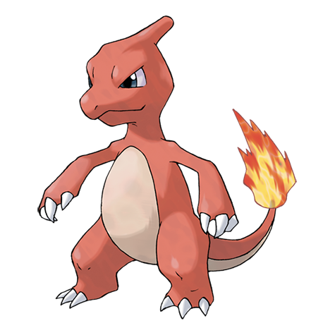

---
title: "Charmeleon (#0005)"
category: Pokedex
tags: [charmeleon, kanto, fire]
image: "assets/images/pokemon/005.png"
---

# Charmeleon (#0005)

*Flame Pokemon*

**Type:** Fire
**Abilities:** [[Blaze]], [[Solar Power]] *(Hidden)*
**Base HP:** 4

> It turns aggressive after evolving, it is very hot-headed by nature, so it constantly starts fights. When it’s excited, the flame at the tip of its tail flares with a bluish white color.

---

## Statistiche (Attributes & Limits)

| Attribute | Base / Limit |
|---|---|
| **Strength** | 2/4 |
| **Dexterity** | 2/5 |
| **Vitality** | 2/4 |
| **Special** | 2/5 |
| **Insight** | 2/4 |

---

## Mosse (Learnset)

- **Starter:** [[Scratch]], [[Growl]]
- **Beginner:** [[Ember]], [[Smokescreen]]
- **Amateur:** [[Dragon_Rage]], [[Scary_Face]], [[Fire_Fang]], [[Flame_Burst]], [[Slash]], [[Fire_Spin]]
- **Ace:** [[Flamethrower]], [[Inferno]]
- **Pro:** [[Metal_Claw]], [[Dragon_Dance]], [[Fire_Pledge]]

---

## Correlati

### Catena Evolutiva
- [[0004_Charmander|Charmander]]
- [[0006_Charizard|Charizard]]
