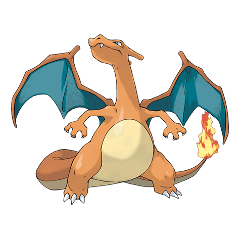

# Charizard (Mega Y Form) (#0006M1)

*Flame Pokemon*

**Type:** Fuoco / Volante
**Abilities:** [[Drought]]
**Base HP:** 6

> With the power of the Mega Stone It becomes bold and confident. Its flying skills get better and t boasts speed and maneuverability. When it flies you cannot see it directly as its flames burn as bright as the sun.

---

## Statistiche (Attributes & Limits)

| Attribute | Base / Limit |
|---|---|
| **Strength** | 3/6 |
| **Dexterity** | 3/6 |
| **Vitality** | 2/5 |
| **Special** | 4/8 |
| **Insight** | 3/6 |

---

## Mosse (Learnset)

- **Starter:** [[Scratch|Scratch]], [[Smokescreen|Smokescreen]]
- **Beginner:** [[Ember|Ember]], [[Growl|Growl]]
- **Amateur:** [[Fire_Fang|Fire Fang]], [[Dragon_Rage|Dragon Rage]], [[Air_Slash|Air Slash]], [[Slash|Slash]], [[Scary_Face|Scary Face]], [[Fire_Spin|Fire Spin]], [[Flame_Burst|Flame Burst]], [[Wing_Attack|Wing Attack]]
- **Ace:** [[Dragon_Claw|Dragon Claw]], [[Flamethrower|Flamethrower]], [[Shadow_Claw|Shadow Claw]], [[Flare_Blitz|Flare Blitz]], [[Heat_Wave|Heat Wave]]
- **Pro:** [[Inferno|Inferno]], [[Thunder_Punch|Thunder Punch]], [[Outrage|Outrage]], [[Blast_Burn|Blast Burn]]

---
