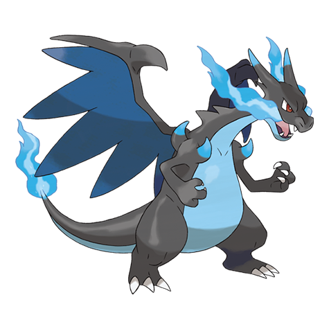
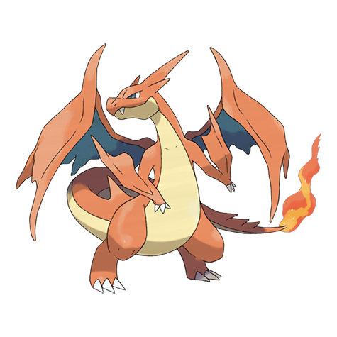
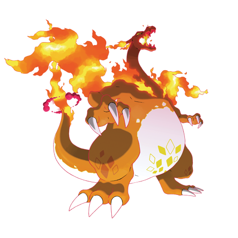

---
title: "Charizard (#0006)"
category: Pokedex
tags: [charizard, kanto, fire, flying]
image: "assets/images/pokemon/006.png"
---

# Charizard (#0006)

*Flame Pokemon*

**Type:** Fire / Flying
**Abilities:** [[Blaze]], [[Solar Power]] *(Hidden)*
**Base HP:** 5

> A Charizard flies around looking for strong opponents. It breathes intense flames that can melt any material. However, it will never touch a weaker foe. Not many trainers are able to handle its bad temper.

---

## Statistiche (Attributes & Limits)

| Attribute | Base / Limit |
|---|---|
| **Strength** | 2/5 |
| **Dexterity** | 3/6 |
| **Vitality** | 2/5 |
| **Special** | 3/6 |
| **Insight** | 2/5 |

---

## Mosse (Learnset)

- **Starter:** [[Scratch]], [[Smokescreen]]
- **Beginner:** [[Ember]], [[Growl]]
- **Amateur:** [[Fire_Fang]], [[Dragon_Rage]], [[Air_Slash]], [[Slash]], [[Scary_Face]], [[Fire_Spin]], [[Flame_Burst]], [[Wing_Attack]]
- **Ace:** [[Dragon_Claw]], [[Flamethrower]], [[Shadow_Claw]], [[Flare_Blitz]], [[Heat_Wave]]
- **Pro:** [[Inferno]], [[Thunder_Punch]], [[Outrage]], [[Blast_Burn]]

---

## Forme Speciali

<strong>Mega Charizard X</strong>

<strong>Mega Charizard Y</strong>

<strong>Charizard (Gigantamax)</strong>

---

## Correlati

### Catena Evolutiva
- [[0004_Charmander|Charmander]]
- [[0005_Charmeleon|Charmeleon]]
